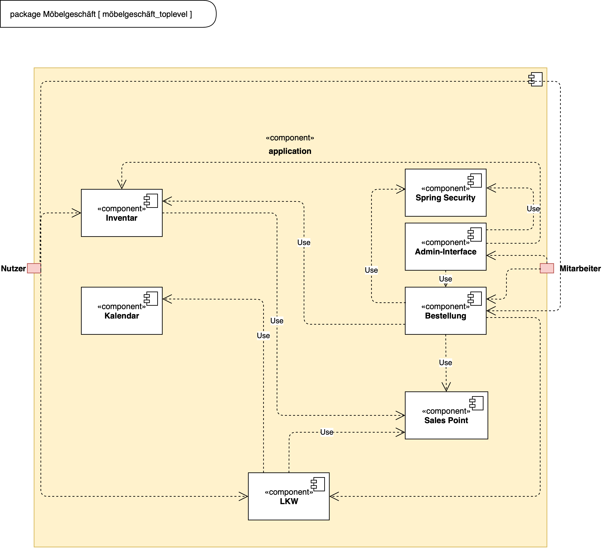

= Entwicklerdokumentation
:toc:
:numbered:

[options="header"]
[cols="1, 3, 3"]
|===
|Version | Bearbeitungsdatum   | Autor 
|...	| ... | ...
|===

== Einführung und Ziele
=== Aufgabenstellung
Das von der Moebel-Hunger-Kette übernommene Geschäft Möbel-Hier wird von Ihrer Firma mit einer neuen Kundensoftware ausgestattet. Im Leistungsumfang sind die Bestellverwaltung, das Warenlager und der Auslieferungsservice enthalten. Besonderes Augenmerk soll auf die Warenbestellung, -zwischenlagerung und -auslieferung gelegt werden.

Den Kunden liegt ein Sortiment im Internet vor, aus dem sie Möbel bestellen können, dafür ist keine Anmeldung nötig. Die Lieferung erfolgt entweder in das Hauptlager oder direkt an den Kunden.

Weiterhin soll eine Statusabfrage über die bereits gelieferten Möbelteile der Bestellungen möglich sein. Wenn der Kunde unbedingt will, kann er die bereits gelieferte Ware in Teilen abholen, muss dann aber auch diese Teile sofort bezahlen.

Ein Grundsatz des Möbelhauses heißt Modularität. Der Kunde kann sich die meisten Möbelstücke einzeln bestellen, jedoch auch vorgefertigte Sätze, so z.B. eine Couchecke mit Ein-, Zwei- und Dreisitzer. Variabilität ist beispielsweise über die Farbe oder den Bezug möglich. Einige Möbelstücke können allerdings nur in Kombination mit anderen bestellt werden. Ein Couchtisch besteht beispielsweise aus Gestell und Platte, wobei es von beiden Komponenten mehrere Ausfertigungen gibt.

Die Auslieferung erfolgt mit dem firmeneigenen LKW-Park. Alternativ können sich Kunden auch diese LKW's für einen Tag mieten. Je nach Gewicht der Lieferung soll immer der nächstgünstigere LKW von der Firma zum Ausliefern genutzt werden.

Die Software soll auch das Abbestellung der Ware berücksichtigen. Je nach Bearbeitungsstand einer Lieferung errechnet sich eine Rücklieferungsgebühr. Die Stornierung eines LKW ist kostenlos.

Das Angebotsspektrum von Möbel-Hier ergibt sich aus den Katalogen der angegliederten Großlieferanten. Die Geschäftsbeziehungen zu diesen Firmen soll entsprechend verwaltet werden. Die Preiskalkulation für die Waren findet gruppiert nach den Großlieferanten statt, so ergeben bspw. die Kundenpreise der Waren des Lieferanten Großmöbel 205% des Lieferpreises.

Die Mitarbeiter sollten durch eine Anmeldung die Möglichkeit haben, Bestellungen einzusehen oder zu bearbeiten sowie das Möbelgeschäft zu verwalten. Um die Attraktivität des Angebotes steigern zu können, möchte die Geschäftsführung von Möbel-Hier eine monatliche Abrechnung (mit Vergleich zum Vormonat) haben, in der die Möbelverkäufe nach Großlieferanten aufgegliedert aufgeführt sind.

=== Qualitätsziele

Die folgende Tabelle zeigt, welche Qualitätsziele in welchem Ausmaß erfüllt werden sollen.

1 = Nicht wichtig | 5 = Sehr wichtig

[options="header", cols="3h, 1, 1, 1, 1, 1"]
|===
|Qualitätsanspruch        | 1 | 2 | 3 | 4 | 5
|Zuverlässigkeit          |   |   |   |   | x
|Sicherheit               |   |   |   | x |
|Benutzerfreundlichkeit   |   |   |   | x |
|Wartbarkeit              |   |   | x |   |

|===

== Randbedingungen
=== Hardware-Vorgaben
Folgende Geräte sind notwendig um die Software zu bedienen:

- Server
- Computer
- Maus
- Tastatur

=== Software-Vorgaben

Um die Software auf dem Server laufen zu lassen ist mindestens die folgende Java Version notwendig:

- Java 11

Um die Software zu nutzen sind mindestens folgende Browser-Versionen notwendig:

- Mozilla Firefox, Version 82.0.1+
- Chromium basierende Browser, Version 86.0.4240.1+

=== Vorgaben zum Betrieb des Software

Dieser Abschnitt gibt einen kurzen Überblick über die geplante Verwendung des Produkts.

Das System soll als Webshop von Möbel-hier verwendet werden, um Möbel und Möbel-Sets zu verkaufen und auszuliefern. Einige dieser Möbel-Sets können von den Kunden noch vor der Bestellung individuell angepasst werden. Außerdem beinhaltet das System einen LKW-Verleih, über den die Liefer-LKWs direkt an die Kunden vermietet werden können.
Die Kunden sollen mithilfe eines Browsers jederzeit Zugriff auf den Webshop haben.

Die Hauptnutzer des Webshops sind Kunden, die bereits mit der üblichen Webseite-Navigation vertraut sind. Mitarbeiter der Moebel-Hunger-Kette haben erweiterten Zugriff auf bestellungsrelevante Informationen, brauchen dafür jedoch kein technisches Sachverständnis. Alle für sie relevanten Daten sind in einer Datenbank abgespeichert und mithilfe einer grafischen Oberfläche direkt auf der Webseite aufrufbar.

== Kontextabgrenzung

image::./models/analysis/context_diagram_2.png[Kontextdiagramm,100%,100%,pdfwidth=100%,title= "Kontextdiagramm des Projektes {project_name}",align=center]

== Lösungsstrategie
=== Erfüllung der Qualitätsziele
[options="header"]
|=== 
|Qualitätsziel |Lösungsansatz
|... |...
|===

=== Softwarearchitektur

* Beschreibung der Architektur anhand der Top-Level-Architektur oder eines Client-Server-Diagramms

=== Entwurfsentscheidungen
* Verwendete Muster
* Persistenz
* Benutzeroberfläche
* Verwendung externer Frameworks

[options="header", cols="1,2"]
|===
|Externes Package |Verwendet von (Klasse der eigenen Anwendung)
|... |... 
|===

== Bausteinsicht
* Entwurfsklassendiagramme der einzelnen Packages

[options="header"]
|=== 
|Klasse/Enumeration |Description
|...|...
|===

=== Rückverfolgbarkeit zwischen Analyse- und Entwurfsmodell
_Die folgende Tabelle zeigt die Rückverfolgbarkeit zwischen Entwurfs- und Analysemodell. Falls eine Klasse aus einem externen Framework im Entwurfsmodell eine Klasse des Analysemodells ersetzt,
wird die Art der Verwendung dieser externen Klasse in der Spalte *Art der Verwendung* mithilfe der folgenden Begriffe definiert:_

* Inheritance/Interface-Implementation
* Class Attribute
* Method Parameter

[options="header"]
|===
|Klasse/Enumeration (Analysemodell) |Klasse/Enumeration (Entwurfsmodell) |Art der Verwendung
|...|...|...
|===

== Laufzeitsicht
* Darstellung der Komponenteninteraktion anhand eines Sequenzdiagramms, welches die relevantesten Interaktionen darstellt.

== Technische Schulden
* Auflistung der nicht erreichten Quality Gates und der zugehörigen SonarQube Issues zum Zeitpunkt der Abgabe

