= Entwicklerdokumentation
:toc:
:numbered:

[options="header"]
[cols="1, 3, 3"]
|===
|Version | Bearbeitungsdatum   | Autor 
|0.1	|25.11.2020 | David Schroth, Marc Albrecht, Sebastian Jaster, Edgar Wolfert, Johannes Kaufmann, Shintaro Onogi
|1.0	|11.01.2021 | David Schroth, Marc Albrecht, Sebastian Jaster, Edgar Wolfert, Johannes Kaufmann, Shintaro Onogi
|===

== Einführung und Ziele
=== Aufgabenstellung
Das von der Moebel-Hunger-Kette übernommene Geschäft Möbel-Hier wird von Ihrer Firma mit einer neuen Kundensoftware ausgestattet. Im Leistungsumfang sind die Bestellverwaltung, das Warenlager und der Auslieferungsservice enthalten. Besonderes Augenmerk soll auf die Warenbestellung, -zwischenlagerung und -auslieferung gelegt werden.

Den Kunden liegt ein Sortiment im Internet vor, aus dem sie Möbel bestellen können, dafür ist keine Anmeldung nötig. Die Lieferung erfolgt entweder in das Hauptlager oder direkt an den Kunden.

Weiterhin soll eine Statusabfrage über die bereits gelieferten Möbelteile der Bestellungen möglich sein. Wenn der Kunde unbedingt will, kann er die bereits gelieferte Ware in Teilen abholen, muss dann aber auch diese Teile sofort bezahlen.

Ein Grundsatz des Möbelhauses heißt Modularität. Der Kunde kann sich die meisten Möbelstücke einzeln bestellen, jedoch auch vorgefertigte Sätze, so z.B. eine Couchecke mit Ein-, Zwei- und Dreisitzer. Variabilität ist beispielsweise über die Farbe oder den Bezug möglich. Einige Möbelstücke können allerdings nur in Kombination mit anderen bestellt werden. Ein Couchtisch besteht beispielsweise aus Gestell und Platte, wobei es von beiden Komponenten mehrere Ausfertigungen gibt.

Die Auslieferung erfolgt mit dem firmeneigenen LKW-Park. Alternativ können sich Kunden auch diese LKW's für einen Tag mieten. Je nach Gewicht der Lieferung soll immer der nächstgünstigere LKW von der Firma zum Ausliefern genutzt werden.

Die Software soll auch das Abbestellung der Ware berücksichtigen. Je nach Bearbeitungsstand einer Lieferung errechnet sich eine Rücklieferungsgebühr. Die Stornierung eines LKW ist kostenlos.

Das Angebotsspektrum von Möbel-Hier ergibt sich aus den Katalogen der angegliederten Großlieferanten. Die Geschäftsbeziehungen zu diesen Firmen soll entsprechend verwaltet werden. Die Preiskalkulation für die Waren findet gruppiert nach den Großlieferanten statt, so ergeben bspw. die Kundenpreise der Waren des Lieferanten Großmöbel 205% des Lieferpreises.

Die Mitarbeiter sollten durch eine Anmeldung die Möglichkeit haben, Bestellungen einzusehen oder zu bearbeiten sowie das Möbelgeschäft zu verwalten. Um die Attraktivität des Angebotes steigern zu können, möchte die Geschäftsführung von Möbel-Hier eine monatliche Abrechnung (mit Vergleich zum Vormonat) haben, in der die Möbelverkäufe nach Großlieferanten aufgegliedert aufgeführt sind.

=== Qualitätsziele

Die folgende Tabelle zeigt, welche Qualitätsziele in welchem Ausmaß erfüllt werden sollen.

1 = Nicht wichtig | 5 = Sehr wichtig

[options="header", cols="3h, 1, 1, 1, 1, 1"]
|===
|Qualitätsanspruch        | 1 | 2 | 3 | 4 | 5
|Zuverlässigkeit          |   |   |   |   | x
|Sicherheit               |   |   |   | x |
|Benutzerfreundlichkeit   |   |   |   | x |
|Wartbarkeit              |   |   | x |   |

|===

== Randbedingungen
=== Hardware-Vorgaben
Folgende Geräte sind notwendig um die Software zu bedienen:

- Server
- Computer
- Maus
- Tastatur

=== Software-Vorgaben

Um die Software auf dem Server laufen zu lassen ist mindestens die folgende Java Version notwendig:

- Java 11

Um die Software zu nutzen sind mindestens folgende Browser-Versionen notwendig:

- Mozilla Firefox, Version 82.0.1+
- Chromium basierende Browser, Version 86.0.4240.1+

=== Vorgaben zum Betrieb des Software

Dieser Abschnitt gibt einen kurzen Überblick über die geplante Verwendung des Produkts.

Das System soll als Webshop von Möbel-hier verwendet werden, um Möbel und Möbel-Sets zu verkaufen und auszuliefern. Einige dieser Möbel-Sets können von den Kunden noch vor der Bestellung individuell angepasst werden. Außerdem beinhaltet das System einen LKW-Verleih, über den die Liefer-LKWs direkt an die Kunden vermietet werden können.
Die Kunden sollen mithilfe eines Browsers jederzeit Zugriff auf den Webshop haben.

Die Hauptnutzer des Webshops sind Kunden, die bereits mit der üblichen Webseite-Navigation vertraut sind. Mitarbeiter der Moebel-Hunger-Kette haben erweiterten Zugriff auf bestellungsrelevante Informationen, brauchen dafür jedoch kein technisches Sachverständnis. Alle für sie relevanten Daten sind in einer Datenbank abgespeichert und mithilfe einer grafischen Oberfläche direkt auf der Webseite aufrufbar.

== Kontextabgrenzung

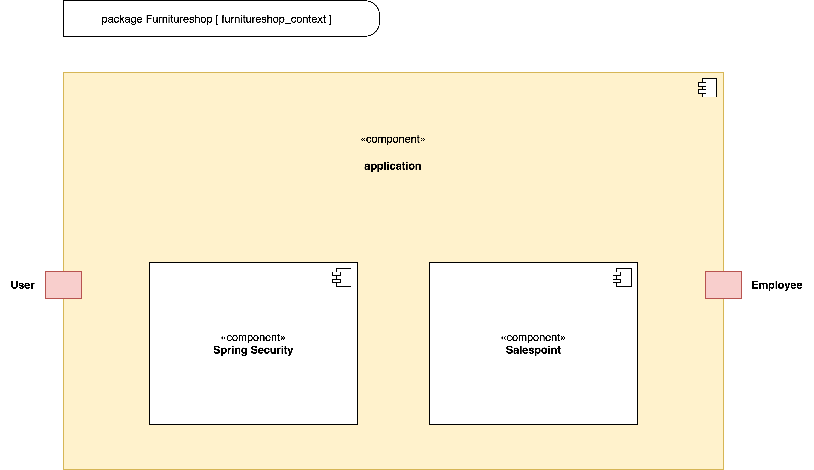

== Lösungsstrategie
=== Erfüllung der Qualitätsziele
[options="header"]
|=== 
|Qualitätsziel |Lösungsansatz
|Zuverlässigkeit a|
* *Erreichbarkeit* Solange keine Systemunabhängigen Störungen vorliegen, läuft das System stabil und ist ohne Probleme erreichbar.
|Sicherheit a|
* *Vertraulichkeit* Auf Bestellungen kann nur vom jeweiligen Kunden selbst, Mitarbeitern und Administratoren zugegriffen werden.
|Benutzerfreundlichkeit a|
* *Erlernbarkeit* Die Anwendung ist übersichtlich aufgebaut, sodass ihre Funktionsweise von Benutzern schnell erlernt werden kann.
* *Fehlervermeidung* Fehlerhafte Eingaben werden im System abgefangen und dem Benutzer mitgeteilt.
* *Gestaltung der Benutzeroberfläche* Sorgt für eine angenehmes und zufriedenstelledes Benutzererlebnis.
* *Zugänglichkeit* Das System soll für so viele Leute wie möglich gut bedienbar sein. Das wird unter anderem durch klare Kontraste und die Unterstützung mehrerer Sprachen realisiert.
|Wartbarkeit a|
* *Modularität* Die Anwendung besteht aus möglichst eigenständigen Bestandteilen, sodass Änderungen eines Bestandteils wenig Auswirkungen auf den Rest der Anwendung haben.
* *Wiederverwendbarkeit* Bestandteile der Anwendung können mit wenig Aufwand in anderen Bereichen wiederverwendet werden.
* *Modifizierbarkeit* Die Anwendung kann ohne Qualitätsverlust verändert und erweitert werden.
|===

=== Softwarearchitektur

* Beschreibung der Architektur anhand der Top-Level-Architektur oder eines Client-Server-Diagramms

=== Entwurfsentscheidungen
* Verwendete Muster
- Verwendung des Composite-Pattern um Artikel und Sets zu modellieren
- Spring MVC

* Persistenz
- Die Anwendung nutzt *Annotation-basiertes Mapping* um Java Klassen in Tabellen einer Datenbankkonvertieren. Als Datenbank wird *H2* genutzt.
- Die Persistenz ist standardmäßig deaktiviert. Um sie zu aktivieren, müssen folgende Zeilen in der _application.properties_ nicht mehr auskommentiert sein:
....
# spring.datasource.url=jdbc:h2:./db/furnitureshop
# spring.jpa.hibernate.ddl-auto=update
....
* Benutzeroberfläche
- Benutzung von Bootstrap für die Webseitengestaltung
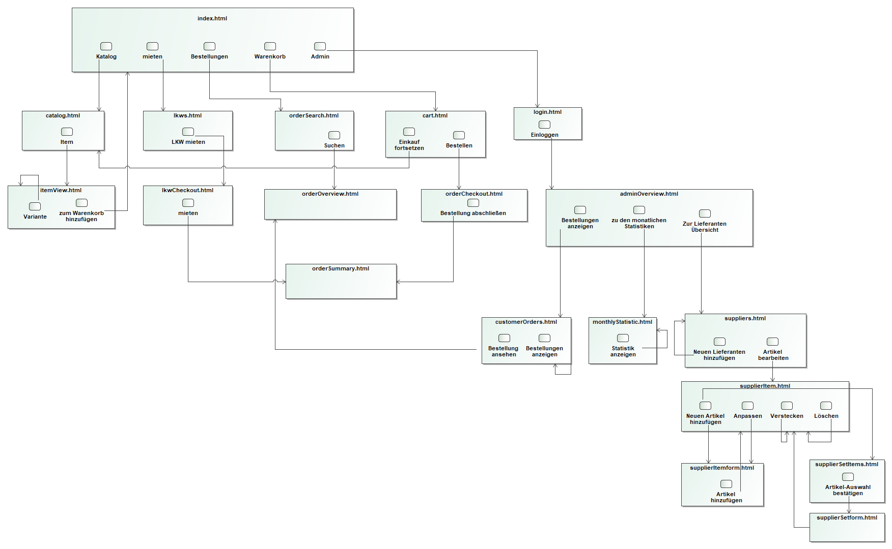

* Verwendung externer Frameworks

[options="header", cols="1,2"]
|===
|Externes Package |Verwendet von (Klasse der eigenen Anwendung)
|salespointframework.catalog a| 
 * OrderService 
 * Item
 * ItemCatalog
 * ItemService
 * LKW
 * LKWCatalog
 * LKWService
 * ItemOrder
|salespointframework.core a|
 * ItemDataInitializer
 * ItemController
 * LKWDataInitializer
 * LKWController
 * OrderDataInitializer
 * OrderController
 * SupplierDataInitializer
 * SupplierController
 * ItemService
 * Set
 * StaticEntry
 * LKWType
 * ItemOrder
 * LKWCharter
| salespointframework.order a|
 * ItemOrder
 * OrderController
 * OrderDataInitializer
 * OrderService
 * ShopOrder
| salespointframework.Quantity a|
 * ItemOrder
 * OrderController
 * OrderService
| salespointframework.SalespointSecurityConfiguration a|
 * FurnitureShop
| salespointframework.time a|
 * LKWController
 * ItemController
 * ItemService
 * OrderController
 * OrderDataInitializer
 * OrderService
| salespointframework.useraccount a|
 * OrderService
 * Delivery
 * ItemOrder
 * LKWCharter
 * Pickup
 * ShopOrder
| salespointframework.EnableSalespoint a|
 * FurnitureShop
| springframework.boot a| 
 * FurnitureShop
| springframework.data a|
 * ItemController
 * ItemService
 * Set
 * LKWCatalog
 * LKWService
 * ItemOrder
 * OrderController
 * OrderService
 * SupplierRepository
 * SupplierService
| springframework.security a|
 * FurnitureShop
 * AdminController
 * OrderController
| springframework.ui a|
 * OrderController
 * ItemController
 * LKWController
 * SupplierController
| springframework.util a|
 * Supplier
 * Category
 * Item
 * ItemController
 * ItemDataInitilizer
 * ItemService
 * Piece
 * Set
 * Calendar
 * CalendarEntry
 * DeliveryEntry
 * LKW
 * LKWController
 * LKWDataInitilizer
 * LKWService
 * LKWType
 * ContactInformation
 * Delivery
 * ItemOrder
 * ItemOrderEntry
 * LKWCharter
 * OrderController
 * OrderDataInitilizer
 * OrderService
 * ShopOrder
 * SupplierController
 * SupplierDataInitializer
 * SupplierService
| springframework.web a| 
 * ItemController
 * FurnitureShop
 * AdminController
 * ItemForm
 * LKWController
 * OrderController
 * SupplierController
| sprimgframework.context a|
 * LKWService
 * FurnitureShop
 * ItemService
| springframework.stereotype a|
 * OrderController
 * AdminController
 * ItemController
 * LKWController
 * SupplierController
 * ItemDataIntitializer
 * LKWDataInitializer
 * OrderDataInitializer
 * SupplierDataInitializer
 * ItemService
 * LKWService
 * OrderService
 * SupplierService
| springframework.transaction a|
 * LKWService
 * ItemService
 * SupplierService
| springframework.format a| 
 * LKWCharterForm
|===

== Bausteinsicht

=== Furnitureshop
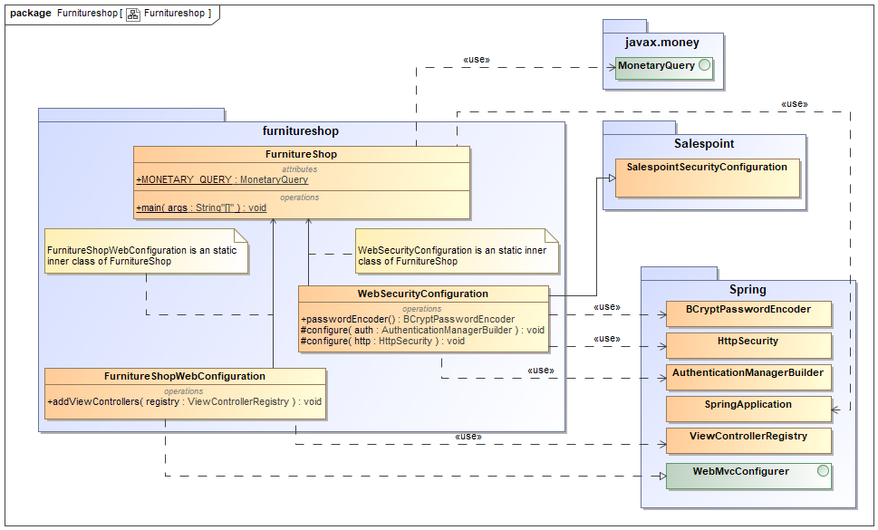

[options="header"]
|=== 
|Klasse/Enumeration |Description
|FurnitureShop | Zentrale Klasse zum Ausführen und Konfigurieren der Anwendung
|FurnitureShopWebConfiguration | Konfigurationsklasse um das Routing von `/` auf `index.html` zu leiten
|WebSecurityConfiguration | Konfigurationsklasse die eine einfache Authentifizierung mithilfe von `admin/admin` ermöglicht 
|===

=== Admin
image:models/design/Admin.png[Klassendiagramm - Admin]

[options="header"]
|=== 
|Klasse/Enumeration |Description
|AdminController| Ein Spring MVC Controller der das Routing für den Login und das Admin-Interface regelt
|===

=== Inventory
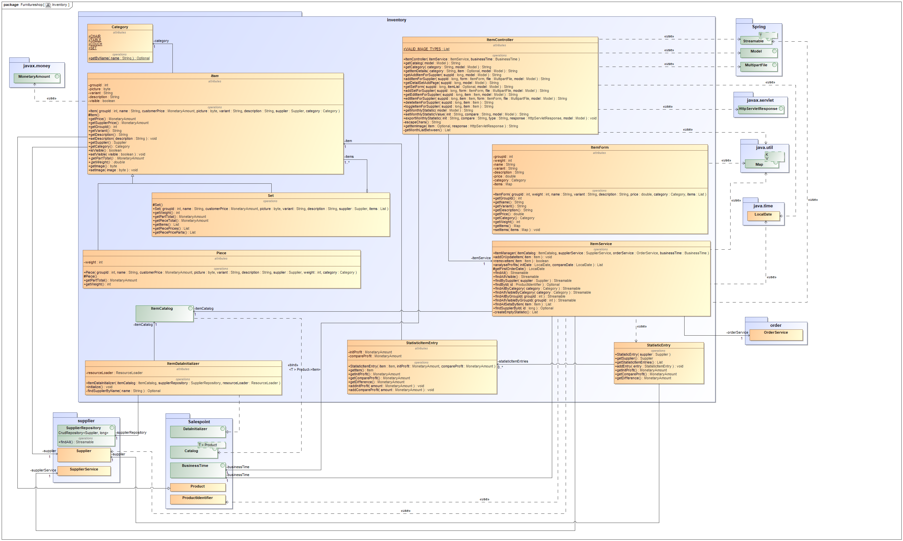

[options="header"]
|===
|Klasse/Enumeration |Description
|Category           |Ein Enum, welches die verfügbaren Kategorien repräsentiert
|Item               |Ein Salespoint Product, welches entweder ein Piece oder ein Set repräsentiert
|ItemCatalog        |Ein Salespoint Catalog, welcher alle Items des Inventars speichert
|ItemController     |Ein Spring MVC Controller der das Routing für Items regelt
|ItemDataInitializer|Ein Spring MVC DataInitializer der Items zur Datenbank hinzufügt
|ItemService        |Ein Spring MVC Service der alle An/Abfragen bezüglich Items regelt
|Piece              |Ein einzelnes Möbelstück
|Set                |Eine Liste von zusammengehörigen Möbelstücken
|===

=== LKW
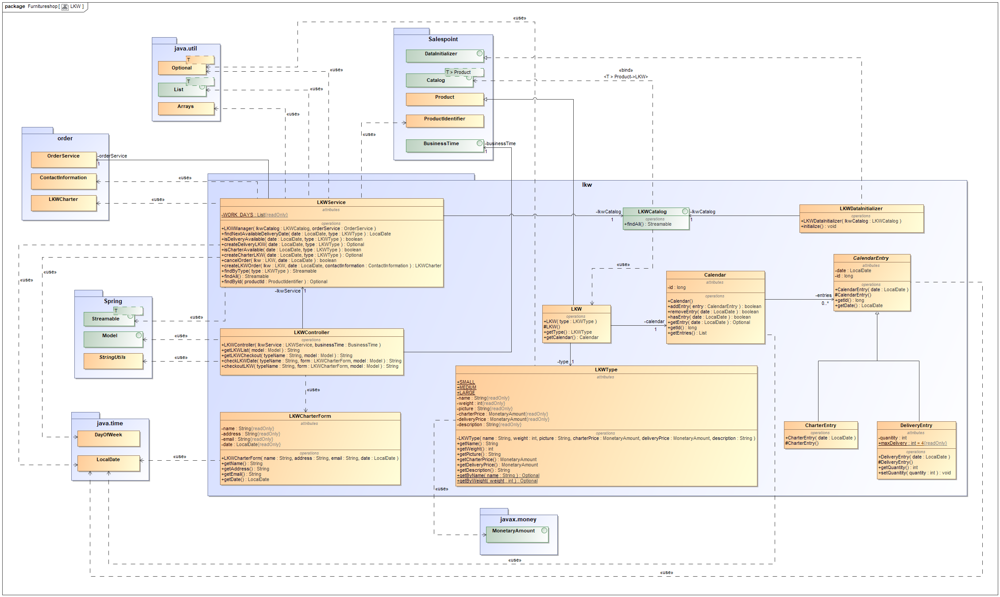

[options="header"]
|=== 
|Klasse/Enumeration |Description
|Calender           |Kalender eines LKWs mit Kalendereintrag pro Tag
|CalenderEntry      |Eintrag eines Kalenders zur Speicherung, ob der LKW an einem Tag benutzt wird
|CharterEntry       |Kalendereintrag, wenn ein Kunde den LKW mietet
|DeliveryEntry      |Kalendereintrag, wenn der LKW zur Auslieferung genutzt wird
|LKW                |Repräsentiert einen physischen LKW im Code und in der Datenbank
|LKWCatalog         |Ein Salespoint Calalog, wo alle LKWs gespeichert werden
|LKWCharterForm     |Form welches die Nutzereingaben der LKW-Vermietungsseite beinhaltet
|LKWController      |Ein Spring MVC Controller der das Routing für die LKW Bestellung regelt
|LKWDataInitializer |Ein Spring MVC DataInitializer der LKWs zur Datenbank hinzufügt
|LKWService         |Ein Spring MVC Service der alle An/Abfragen bezüglich LKWs und deren Kalender regelt
|LKWType            |Enum welches die einzelnen verfügbaren LKW Typen repräsentiert
|===

=== Supplier
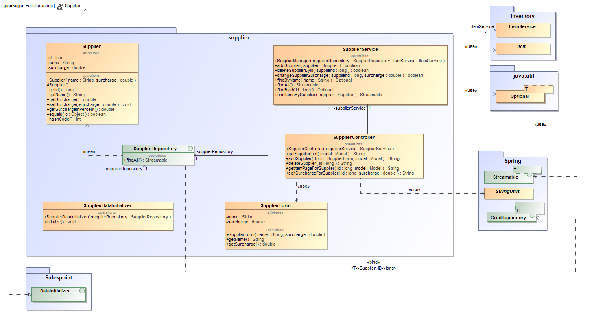

[options="header"]
|=== 
|Klasse/Enumeration     |Description
|Supplier               |Ein Lieferant des Möbelgeschäfts mit Name und Preisaufschlag
|SupplierDataInitializer|Ein Spring MVC DataInitializer, der Lieferanten dem "SupplierRepository" hinzufügt
|SupplierForm           |Ein Formular, dass als Zwischenablage für die Eingaben beim Hinzufügen eines Lieferanten dient
|SupplierService        |Ein Spring MVC Service, der die Lieferanten im Repository verwaltet
|SupplierController     |Ein Spring MVC Controller, der das Routing für den Lieferantenbereich regelt

|===

=== Order
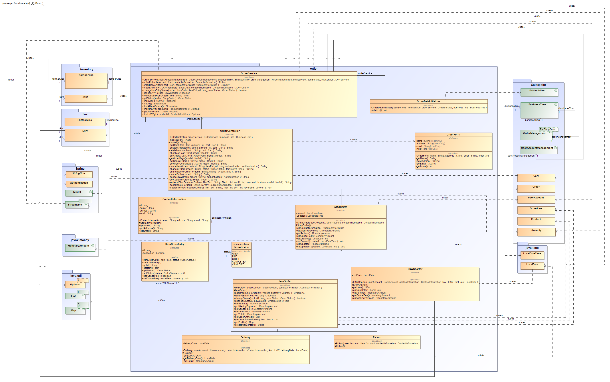

[options="header"]
|=== 
|Klasse/Enumeration |Description
|OrderForm|Speichert den Input des Nutzers bei Abschluss einer Bestellung zur weiteren Verwendung
|OrderStatus| Eine Enumeration die die möglichen Zustände einer Bestellung erfasst
|KontaktInformation| Speichert die Kontaktinformationen eines Kunden
|ItemOrderEntry| Mapt einen Bestelleintrag auf einen dazugehörigen Status
|ItemOrder| Erweitert die Salespoint Order Klasse zur spezifischen Implementierung von Itembestellungen
|Delivery| Erweitert ItemOrder um Bestellungen mit anschließender Lieferung zu implementieren
|Pickup| Erweitert Itemorder um Bestellungen mit anschließender Abholung im Lager zu implementieren
|LKWCharter| Erweitert eine Shoporder um das Mieten von LKW´s zu unterstützen
|ShopOrder| Erweitert die Salespoint Order Klasse um die Verknüpfung zu Kontaktinformationen
|OrderDataInitializer| Ein Spring MVC DataInitializer der einen Dummy-Nutzer erstellt, auf den alle Bestellungen registriert sind, da keine Nutzeraccounts für die Bestellungen notwending sein sollen
|OrderController| Ein Spring MVC Controller der den Warenkorb inklusive des Routings handhabt
|OrderService| Ein Spring MVC Service der die Logik hinter allen Bestellungen managed
|===

=== Rückverfolgbarkeit zwischen Analyse- und Entwurfsmodell
_Die folgende Tabelle zeigt die Rückverfolgbarkeit zwischen Entwurfs- und Analysemodell. Falls eine Klasse aus einem externen Framework im Entwurfsmodell eine Klasse des Analysemodells ersetzt,
wird die Art der Verwendung dieser externen Klasse in der Spalte *Art der Verwendung* mithilfe der folgenden Begriffe definiert:_

* Inheritance/Interface-Implementation
* Class Attribute
* Method Parameter

[options="header"]
|===
|Klasse/Enumeration (Analysemodell) |Klasse/Enumeration (Entwurfsmodell) |Art der Verwendung
|Möbelgeschäft |Furnitureshop |-
|Item |Item |-
|Set |Set |-
|Teil |Piece |-
|Kategorie |Category |-
|Inventar |ItemService |-
|Warenkorb |Salespoint.Cart |Session Attribute
|WarenkorbEintrag |Salespoint.CartItem |Method Parameter (bei Salespoint.Cart)
|LieferantManager |SupplierService |-
|Lieferant |Supplier |-
|LKWManager |LKWService |-
|LKW |LKW |-
|Kalender |Calendar |-
|Kalendereintrag |CalendarEntry |-
|Mieteintrag |CharterEntry |-
|Liefereintrag |DeliveryEntry |-
|BestellManager |OrderService |-
|Bestellung |ShopOrder |-
|Kontaktinformationen |ContactInformation |-
|BestellEintrag |ItemOrderEntry |-
|Bestellstatus |OrderStatus |-
|ItemBestellung |ItemOrder |-
|Lieferung |LKWCharter |-
|Abholung |Pickup |-
|LKWMietung |Delivery |-
|===

== Laufzeitsicht

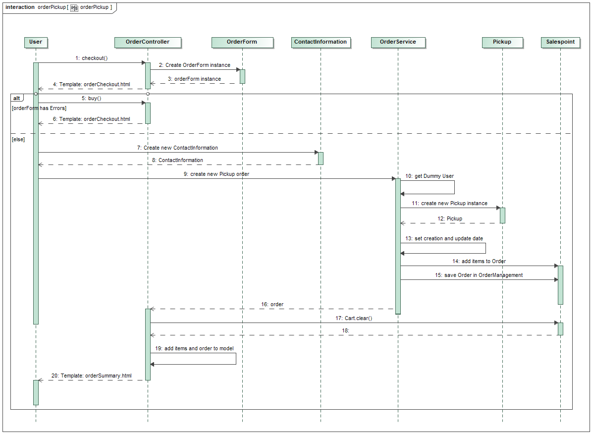

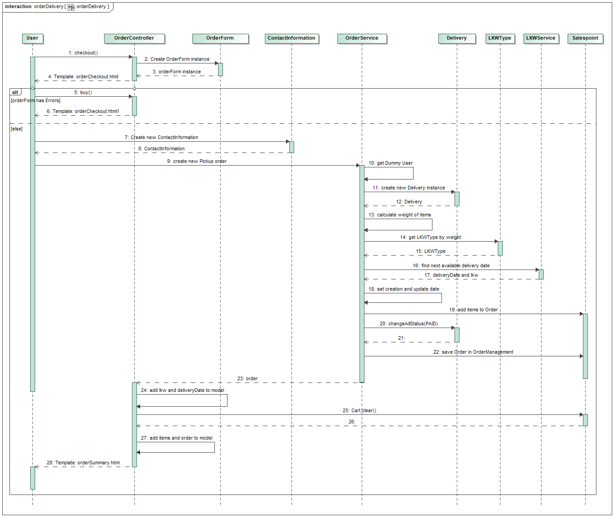

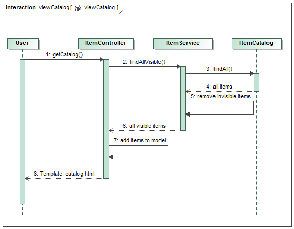

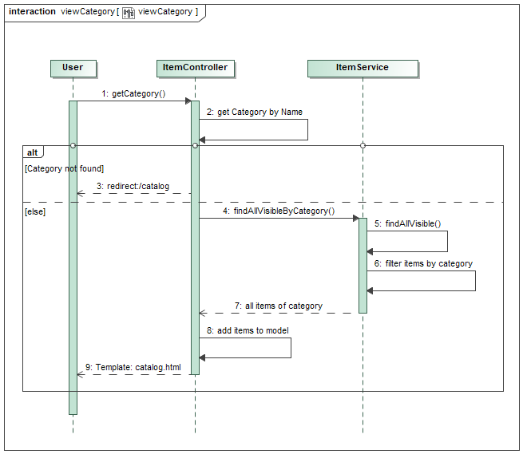

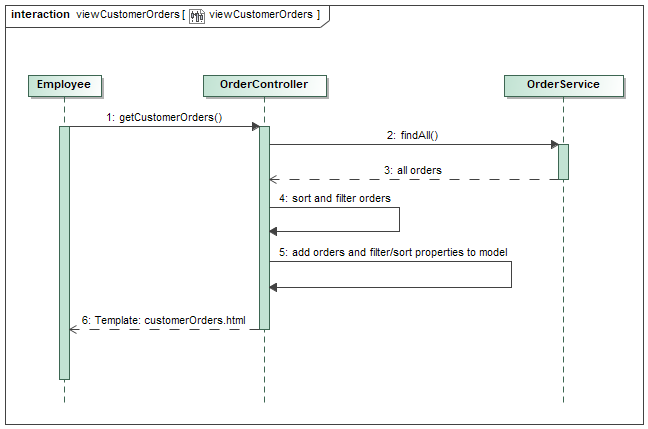

== Technische Schulden
Es sind keine offenen Sonarqube-Issues vorhanden. Das Projekt hat ein A-Rating in Sonarqube und eine Test-Coverage von 95%.

