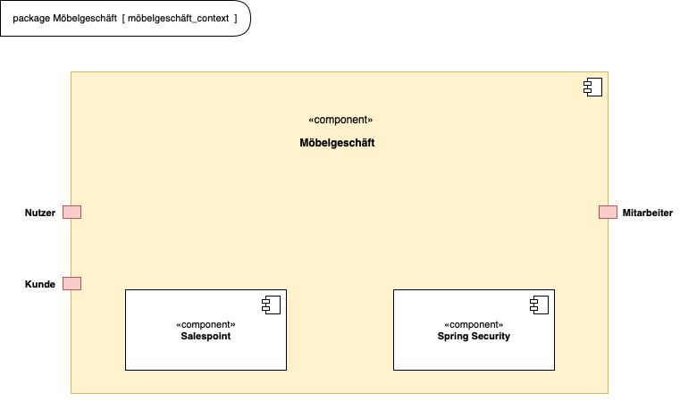
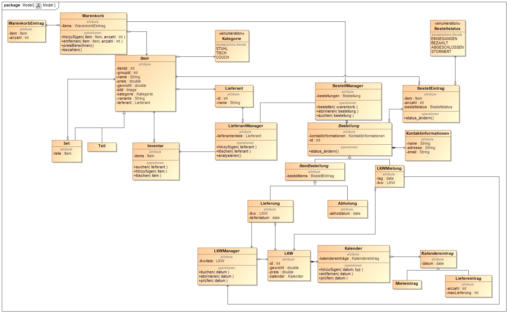

= Pflichtenheft __{project_name}__
:project_name: Möbelgeschäft
:numbered:
:toc:
:toc-title: Inhaltsverzeichnis

[options="header"]
[cols="1, 1, 1, 1, 4"]
|===
|Version | Status      | Bearbeitungsdatum   | Autoren(en) |  Vermerk
|0.1     | In Arbeit   | 10.10.2020          | Autor       | Initiale Version
|===

== Zusammenfassung
Eine kurze Beschreibung des Dokuments. Wenige Absätze.

== Aufgabenstellung und Zielsetzung
Text aus Aufgabenstellung kopieren und ggfs. präzisieren.
Insbesondere ergänzen, welche Ziele mit dem Abschluss des Projektes erreicht werden sollen.

== Produktnutzung
In welchem Kontext soll das System später genutzt werden? Welche Rahmenbedingungen gelten?
Zusätzlich kurze Einleitung für fachfremde Personen

== Interessensgruppen (Stakeholders)
Welche realen und juristischen Personen(-gruppen) haben Einfluss auf die Anforderungen im Projekt?

== Systemgrenze und Top-Level-Architektur

=== Kontextdiagramm
Das Kontextdiagramm zeigt das geplante Software-System in seiner Umgebung. Zur Umgebung gehören alle Nutzergruppen des Systems und Nachbarsysteme. Die Grafik kann auch informell gehalten sein. Überlegen Sie sich dann geeignete Symbole. Die Grafik kann beispielsweise mit Visio erstellt werden. Wenn nötig, erläutern Sie diese Grafik.

=== Top-Level-Architektur
Dokumentieren Sie ihre Top-Level-Architektur mit Hilfe eines Komponentendiagramm.

== Anwendungsfälle

=== Akteure

Akteure sind die Benutzer des Software-Systems oder Nachbarsysteme, welche darauf zugreifen. Dokumentieren Sie die Akteure in einer Tabelle. Diese Tabelle gibt einen Überblick über die Akteure und beschreibt sie kurz. Die Tabelle hat also mindestens zwei Spalten (Akteur Name und Kommentar).
Weitere relevante Spalten können bei Bedarf ergänzt werden.

// See http://asciidoctor.org/docs/user-manual/#tables
[options="header"]
[cols="1,4"]
|===
|**Name** | **Beschreibung**
|_Nutzer_ | Ein Nutzer repräsentiert jede Person die mit der Seite interagiert.
|_Kunde_ | Ein Kunde repräsentiert jeder Person, die auf der Seite ihre Bestellnummer angegeben hat um mit ihrer Bestellung zu interagieren.
|_Mitarbeiter_ | Ein Mitarbeiter repräsentiert die Mitarbeiter der Möbel-Hunger Kette welche im System die Rolle "Mitarbeiter" erhalten, nachdem Sie sich entsprechend eingeloggt haben.
|===

=== Überblick Anwendungsfalldiagramm
Anwendungsfall-Diagramm, das alle Anwendungsfälle und alle Akteure darstellt

[[usecase_diagram]]
image::./images/usecase.png[Anwendungsfalldiagramm, 100%, 100%, pdfwidth=100%, title= "Anwendungsfalldiagramm des Projektes {project_name}", align=center]

=== Anwendungsfallbeschreibungen
Dieser Unterabschnitt beschreibt die Anwendungsfälle. In dieser Beschreibung müssen noch nicht alle Sonderfälle und Varianten berücksichtigt werden. Schwerpunkt ist es, die wichtigsten Anwendungsfälle des Systems zu finden. Wichtig sind solche Anwendungsfälle, die für den Auftraggeber, den Nutzer den größten Nutzen bringen.
Für komplexere Anwendungsfälle ein UML-Sequenzdiagramm ergänzen.
Einfache Anwendungsfälle mit einem Absatz beschreiben.
Die typischen Anwendungsfälle (Anlegen, Ändern, Löschen) können zu einem einzigen zusammengefasst werden.

[cols="1h, 3"]
[[UC010]]
|===
|ID                         |**<<UC010>>**
|Name                       |Einloggen
|Beschreibung               |Ein Nutzer der Seite kann sich mithilfe von notwendigen Logindaten gegenüber dem System authentifizieren um die Rolle des Mitarbeiters zu erhalten.
|Akteur                     |Nutzer
|Auslöser                   |Der Nutzer möchte die Rolle Mitarbeiter erhalten.
|Bedingungen               a| Der Nutzer besitzt gültige Logindaten für das System.
|Notwendige Schritte       a|
  1. Nutzer klickt auf den Login Button in der Navigationsleiste.
  2. Nutzer gibt seine gültigen Logindaten an.
  3. Nutzer bestätigt seine Eingaben mit einem Klick auf den "Login" Button.
|Erweiterungen              |-
|Funktionale Anforderung    | TBD
|===

[cols="1h, 3"]
[[UC100]]
|===
|ID                         |**<<UC100>>**
|Name                       |Warenkorb anschauen
|Beschreibung               |Ein Nutzer der Seite ist in der Lage seinen Warenkorb einzusehen.
|Akteur                     |Nutzer
|Auslöser                   |Der Nutzer möchte die Artikel anschauen die er bisher in den Warenkorb gelegt hat.
|Bedingungen               a| -
|Notwendige Schritte        | Nutzer klickt auf den Warenkorb in der Navigationsleiste.
|Erweiterungen              |-
|Funktionale Anforderung    | TBD
|===

[cols="1h, 3"]
[[UC110]]
|===
|ID                         |**<<UC110>>**
|Name                       |Produkte entfernen
|Beschreibung               |Ein Nutzer kann gegebenfalls Artikel aus seinem Warenkorb entfernen, wenn er sie z.B. nicht mehr benötigt oder bestellen möchte.
|Akteur                     |Nutzer
|Auslöser                   |Der Nutzer möchte einen bestimmten Artikel nicht mehr bestellen.
|Bedingungen               a| Der Nutzer befindet sich im Warenkorb <<UC100>>.
|Notwendige Schritte        | Nutzer klickt auf "Entfernen" am jeweiligen Artikel im Warenkorb um den Artikel zu löschen.
|Erweiterungen              |-
|Funktionale Anforderung    | TBD
|===

[cols="1h, 3"]
[[UC120]]
|===
|ID                         |**<<UC120>>**
|Name                       |Bestellung durchführen
|Beschreibung               |Ein Nutzer hat die Möglichkeit seine Artikel im Warenkorb zu bestellen und damit einen Bestellauftrag auszulösen.
|Akteur                     |Nutzer
|Auslöser                   |Der Nutzer ist mit seinem Einkauf fertig und möchte nun seine Bestellung aufgeben.
|Bedingungen               a| Der Nutzer hat Artikel im Warenkorb und schaut sich den Warenkorb <<UC100>> an.
|Notwendige Schritte       a|
  1. Nutzer klickt auf "Artikel bestellen" im Warenkorb.
  2. Nutzer gibt persönliche Daten (Adresse, E-Mail) an und wählt die Versandoption aus (Lieferung oder Abholung).
  3. Nutzer bestätigt die Eingaben und die Bestellung mithilfe des Buttons "Bestellung abschließen".
|Erweiterungen              |-
|Funktionale Anforderung    | TBD
|===

[cols="1h, 3"]
[[UC200]]
|===
|ID                         |**<<UC200>>**
|Name                       |Artikel-Katalog einsehen
|Beschreibung               |Ein Nutzer hat die Möglichkeit sich den kompletten Artikel-Katalog von Möbel-Hunger anzuschauen.
|Akteur                     |Nutzer
|Auslöser                   | Der Nutzer möchte den Artikel-Katalog anschauen
|Bedingungen               a| -
|Notwendige Schritte       a| Der Nutzer klickt auf "Katalog" in der Navigationsleiste.
|Erweiterungen              |-
|Funktionale Anforderung    | TBD
|===

[cols="1h, 3"]
[[UC210]]
|===
|ID                         |**<<UC210>>**
|Name                       |Artikel oder Artikel-Set ansehen
|Beschreibung               |Ein Nutzer hat die Möglichkeit einzelne Artikel auf der Seite anzuschauen oder vollständige Artikel-Sets.
|Akteur                     |Nutzer
|Auslöser                   | Der Nutzer interessiert sich für einen Artikel genauer und möchte auf die zugehörige Artikelseite gelangen.
|Bedingungen               a| Der Nutzer schaut sich derzeit den Artikel-Katalog <<UC200>> an.
|Notwendige Schritte       a| Der Nutzer klickt auf den Namen des gewünschten Artikel.
|Erweiterungen              |-
|Funktionale Anforderung    | TBD
|===

[cols="1h, 3"]
[[UC220]]
|===
|ID                         |**<<UC220>>**
|Name                       |Artikel Ausführung ändern
|Beschreibung               |Ein Nutzer hat die Möglichkeit die Ausführung (Farbe/Material) eines Artikels oder eines Artikel-Sets zu ändern.
|Akteur                     |Nutzer
|Auslöser                   | Der Nutzer schaut sich einen Artikel bzw ein Artikel-Set an und möchte die unterschiedlichen Ausführungen begutachten.
|Bedingungen               a| Der Nutzer schaut sich derzeit den Artikel oder das Artikel-Set <<UC210>> an.
|Notwendige Schritte       a| Der Nutzer klickt auf eine beliebig aufgelistete Ausführung auf der Artikel-Seite um die Ausführung anzuschauen.
|Erweiterungen              |-
|Funktionale Anforderung    | TBD
|===

[cols="1h, 3"]
[[UC230]]
|===
|ID                         |**<<UC230>>**
|Name                       |Artikel zum Warenkorb hinzufügen
|Beschreibung               |Ein Nutzer hat die Möglichkeit einzelne Artikel oder Artikel-Sets in seinen Warenkorb hinzuzufügen.
|Akteur                     |Nutzer
|Auslöser                   | Der Nutzer möchte diesen Artikel kaufen und ihn deshalb zu seinem Warenkorb hinzufügen.
|Bedingungen               a| Der Nutzer schaut sich derzeit den Artikel oder das Artikel-Set <<UC210>> an.
|Notwendige Schritte       a| Der Nutzer klickt auf den Button "Zum Warenkorb hinzufügen"
|Erweiterungen              |-
|Funktionale Anforderung    | TBD
|===

[cols="1h, 3"]
[[UC300]]
|===
|ID                         |**<<UC300>>**
|Name                       |Bestellung einsehen
|Beschreibung               |Ein Mitarbeiter ist in der Lage eine beliebige Bestellung einzusehen. Ein Kunde kann mithilfe einer gültigen Bestellnummer seine aufgegebene Bestellung einsehen.
|Akteur                     |Mitarbeiter, Kunde
|Auslöser                   |Ein Mitarbeiter oder ein Kunde möchte sich die Details der Bestellung anschauen.
|Bedingungen               a|
_Mitarbeiter:_

Der Mitarbeiter ist gegenüber dem System authentifiziert und hat die Rolle Mitarbeiter erhalten und hat sich zuvor die Kundenbestellungen aufgelistet <<UC410>>.

_Kunde:_

Der Kunde besitzt eine Bestellungsnummer.
|Notwendige Schritte       a|
_Mitarbeiter:_

    1. Mitarbeiter sucht die gewünschte Bestellung aus der Liste der Bestellungen heraus.
    2. Mitarbeiter klickt auf die gewünschte Bestellung in der Liste.

_Kunde:_

    1. Kunde wählt den Reiter "Bestellung einsehen" in der Navigationsleiste.
    2. Kunde gibt seine Bestellnummer in das Eingabefeld ein und drückt auf den Button "Bestätigen".
|Erweiterungen              |
|Funktionale Anforderung    | TBD
|===

[cols="1h, 3"]
[[UC310]]
|===
|ID                         |**<<UC310>>**
|Name                       |Bestellung stornieren
|Beschreibung               |Ein Kunde soll die Möglichkeit haben seine gesamte Bestellung zu stornieren.
|Akteur                     |Kunde
|Auslöser                   |Der Kunde möchte die komplette Bestellung nicht mehr erhalten.
|Bedingungen               a|Der Kunde sieht seine Bestellung derzeit ein <<UC300>>.
|Notwendige Schritte       a|
    1. Der Kunde klickt den Button "Bestellung stornieren".
    2. Der Kunde bestätigt die Stornierung mit einen Klick auf den Button "Bestätigen".
|Erweiterungen              |
|Funktionale Anforderung    | TBD
|===

[cols="1h, 3"]
[[UC320]]
|===
|ID                         |**<<UC320>>**
|Name                       |Artikel stornieren
|Beschreibung               |Ein Kunde soll die Möglichkeit haben einzelne Artikel seiner Bestellung zu stornieren.
|Akteur                     |Kunde
|Auslöser                   |Der Kunde möchte einzelne Artikel seiner Bestellung nicht mehr erhalten.
|Bedingungen               a|Der Kunde sieht seine Bestellung derzeit ein <<UC300>>.
|Notwendige Schritte       a|
    1. Der Kunde sucht den Artikel aus der Artikel-Liste innerhalb der Bestellung.
    2. Der Kunde drückt den zum Artikel zugehörigen Knopf "Artikel stornieren".
    3. Der Kunde bestätigt die Stornierung mit einen Klick auf den Button "Bestätigen".
|Erweiterungen              |
|Funktionale Anforderung    | TBD
|===

[cols="1h, 3"]
[[UC330]]
|===
|ID                         |**<<UC330>>**
|Name                       |Bestellstatus bearbeiten
|Beschreibung               |Ein Mitarbeiter soll in der Lage sein den Status (unbezahlt -> bezahlt) einer Bestellung zu ändern.
|Akteur                     |Mitarbeiter
|Auslöser                   |Ein Kunde hat seine Bestellung per Vorkasse bezahlt und der Mitarbeiter möchte den Zahlungseingang im System bestätigen.
|Bedingungen               a|Der Mitarbeiter schaut sich derzeit die Liste der Bestellungen an <<UC410>>.
|Notwendige Schritte       a|
    1. Der Mitarbeiter sucht die entsprechende Bestellung über die Bestellnummer aus der Liste heraus und klickt diese an.
    2. Der Mitarbeiter drückt auf den Button "Bestellstatus ändern"
    3. Der Mitarbeiter wählt den neuen Status aus dem Dropdown aus.
    4. Der Mitarbeiter klickt auf den Button "Bestätigen" um den Status zu ändern.
|Erweiterungen              |
|Funktionale Anforderung    | TBD
|===

[cols="1h, 3"]
[[UC400]]
|===
|ID                         |**<<UC400>>**
|Name                       |Admin-Interface aufrufen
|Beschreibung               |Ein Mitarbeiter ist in der Lage auf das Admin-Interface der Seite zuzugreifen.
|Akteur                     |Mitarbeiter
|Auslöser                   |Ein Mitarbeiter möchte firmeninterne Daten abrufen.
|Bedingungen               a|Der Mitarbeiter hat sich zuvor mithilfe von <<UC010>> gegenüber dem System authetifiziert.
|Notwendige Schritte       a|
    Der Mitarbeiter drückt auf den Reiter "Admin-Interface" in der Navigatonsleiste.
|Erweiterungen              | Der Reiter "Admin-Interface" erscheint nur wenn der Nutzer im System die Rolle Mitarbeiter erhalten hat.
|Funktionale Anforderung    | TBD
|===

[cols="1h, 3"]
[[UC410]]
|===
|ID                         |**<<UC410>>**
|Name                       |Kundenbestellungen auflisten
|Beschreibung               |Ein Mitarbeiter soll in der Lage sein sich alle Kundenbestellungen mit Bestelldatum und Bestellnummer aufzulisten.
|Akteur                     |Mitarbeiter
|Auslöser                   |Der Mitarbeiter möchte die Bestellungen einsehen und ggf. eine bestimmte Bestellung suchen.
|Bedingungen               a|Der Mitarbeiter befindet sich im Admin-Interface <<UC400>>.
|Notwendige Schritte       a|
    Der Mitarbeiter wählt den Punkt "Kundenbestellungen auflisten" aus und wird dadurch auf die Seite mit allen Bestellungen weitergeleitet.
|Erweiterungen              |
|Funktionale Anforderung    | TBD
|===

[cols="1h, 3"]
[[UC420]]
|===
|ID                         |**<<UC420>>**
|Name                       |Monatsstatistik einsehen
|Beschreibung               |Ein Mitarbeiter soll in der Lage sein die Monatsstatistik der Firma anzuschauen.
|Akteur                     |Mitarbeiter
|Auslöser                   |Der Mitarbeiter möchte die Verkaufszahlen des letzen Monats anschauen.
|Bedingungen               a|Der Mitarbeiter befindet sich im Admin-Interface <<UC400>>.
|Notwendige Schritte       a|
    Der Mitarbeiter wählt den Punkt "Monatsstatistik einsehen" aus und wird auf die Seite der Statistik weitergeleitet.
|Erweiterungen              |
|Funktionale Anforderung    | TBD
|===

[cols="1h, 3"]
[[UC430]]
|===
|ID                         |**<<UC430>>**
|Name                       |Lieferanten verwalten
|Beschreibung               |Ein Mitarbeiter soll in der Lage sein die Lieferanten der Firma zu verwalten (löschen/hinzufügen).
|Akteur                     |Mitarbeiter
|Auslöser                   |Der Mitarbeiter möchte einen Lieferanten aus dem System entfernen oder einen neuen Lieferanten hinzufügen.
|Bedingungen               a|Der Mitarbeiter befindet sich im Admin-Interface <<UC400>>.
|Notwendige Schritte       a|
_Löschen:_

    1. Der Mitarbeiter wählt den Punkt "Lieferanten verwalten" aus und wird auf die Seite mit einer Liste aller Lieferanten weitergeleitet.
    2. Der Mitarbeiter wählt den Button "Lieferant löschen" in der Zeile des gewünschten Lieferanten aus.
    3. Der Mitarbeiter bestätigt das Löschen des Lieferanten mithilfe des Buttons "Bestätigen".

_Hinzufügen:_

    1. Der Mitarbeiter wählt den Punkt "Lieferanten verwalten" aus und wird auf die Seite mit einer Liste aller Lieferanten weitergeleitet.
    2. Der Mitarbeiter wählt "Neuen Lieferant hinzufügen" am Anfang der Liste aus.
    3. Der Mitarbeiter gibt die Daten des neuen Lieferanten ein.
    4. Der Mitarbeiter bestätigt die Eingaben mithilfe des Buttons "Lieferant hinzufügen".
|Erweiterungen              |
|Funktionale Anforderung    | TBD
|===

[cols="1h, 3"]
[[UC500]]
|===
|ID                         |**<<UC500>>**
|Name                       |LKW stornieren
|Beschreibung               |Ein Kunde soll in der Lage sein, seinen gebuchten LKW wieder zu stornieren.
|Akteur                     |Kunde
|Auslöser                   |Der Kunde benötigt seinen gebuchten LKW nicht mehr.
|Bedingungen               a|Der Kunde hat einen LKW gebucht und eine gültige Buchungsnummer.
|Notwendige Schritte       a|
    1. Der Kunde drückt auf den Reiter "Bestellung einsehen" und gibt die Nummer seiner LKW Buchung ein.
    2. Der Kunde drückt auf "Bestätigen" und wird auf die Detailseite der Buchung weitergeleitet
    3. Der Kunde drückt auf "Lkw stornieren" und anschließend auf "Bestätigen" um die Aktion auszuführen.
|Erweiterungen              |
|Funktionale Anforderung    | TBD
|===

[cols="1h, 3"]
[[UC510]]
|===
|ID                         |**<<UC510>>**
|Name                       |LKW buchen
|Beschreibung               |Ein Kunde soll in der Lage sein einen LKW für ein bestimmtes Datum unabhängig von einer Bestellung zu buchen.
|Auslöser                   |Der Kunde benötigt einen LKW.
|Bedingungen               a|
|Notwendige Schritte       a| 
    1. Der Kunde wählt in der Navigationsleiste den Reiter "LKW buchen" aus.
    2. Der Kunde gibt das Datum auf der Bestellseite ein.
    3. Das System weist dem Kunden automatisch einen LKW zu und teilt dem Kunden die Bestellnummer mit.
|Erweiterungen              |
|Funktionale Anforderung    | TBD
|===

== Funktionale Anforderungen

=== Muss-Kriterien
[options="header", cols="2h, 1, 3, 12"]
|===
|ID
|Version
|Name
|Description

|[[F0001]]<<F0001>>
|v1.0
|Sortiment 
a|
Das System muss Artikel dauerhaft in einer Datenbank, welche das Sortiment repräsentiert, speichern.

|[[F0002]]<<F0002>>
|v1.0
|Sortiment verwalten 
a|
Das System muss Mitarbeitern die Möglichkeit bieten, Artikel dem Sortiment hinzuzufügen und Artikel aus dem Sortiment zu entfernen.

|[[F0003]]<<F0003>>
|v1.0
|Sortiment anzeigen 
a|
Das System muss Benutzern die Möglichkeit bieten, alle Artikel des Sortiments anzuzeigen.

|[[F0004]]<<F0004>>
|v1.0
|Sortiment filtern
a|
Das System sollte Benutzern die Möglichkeit bieten, das Sortiment zu filtern.

|[[F0005]]<<F0005>>
|v1.0
|Artikel anzeigen 
a|
Das System muss Benutzern die Möglichkeit bieten, einen ausgewählten Artikel anzuzeigen.

|[[F0006]]<<F0006>>
|v1.0
|Warenkorb
a|
Das System muss einem Benutzer einen Warenkorb zur Verfügung stellen, in dem er Artikel vorübergehend speichern kann.

|[[F0007]]<<F0007>>
|v1.0
|Warenkorb verwalten
a|
Das System muss Benutzern die Möglichkeit bieten, ausgewählte Artikel dem Warenkorb hinzuzufügen oder zu entfernen.

|[[F0008]]<<F0008>>
|v1.0
|Warenkorb anzeigen
a|
Das System muss Benutzern die Möglichkeit bieten, ihren Warenkorb anzuzeigen.

|[[F0009]]<<F0009>>
|v1.0
|Bestellung
a|
Das System muss Bestellungen in einer Datenbank speichern.

|[[F0010]]<<F0010>>
|v1.0
|Bestellung entgegennehmen
a|
Das System muss die Möglichkeit bieten, vom Benutzer eine neue Bestellung in Form eines Warenkorbes entgegenzunehmen.

|[[F0011]]<<F0011>>
|v1.0
|Kunden benachrichtigen
a|
Das System muss fähig sein, Kunden zu benachrichtigen, wenn ihre bestellte Ware im Hauptlager angekommen ist.

|[[F0012]]<<F0012>>
|v1.0
|Statusabfrage anzeigen
a|
Das System muss die Möglichkeit bieten, Kunden anzuzeigen, welche Möbel bereits geliefert wurden.

|[[F0013]]<<F0013>>
|v1.0
|LKW Park
a|
Das System muss LKWs dauerhaft in einer LKW-Park Datenbank speichern.

|[[F0014]]<<F0014>>
|v1.0
|LKW Buchung/Stornierung
a|
Das System muss dem Kunden die Möglichkeit bieten, LKWs aus dem LKW-Park zu buchen oder zu stornieren.

|[[F0015]]<<F0015>>
|v1.0
|monatliche Statistik
a|
Das System muss der Geschäftsführung die Möglichkeit bieten, Statistiken über Verkäufe des letzten Monats mit Vergleich zum Vormonat und nach Großlieferanten aufgegliedert anzuzeigen.

|===

=== Kann-Kriterien
Anforderungen die das Programm leisten können soll, aber für den korrekten Betrieb entbehrlich sind.

== Nicht-Funktionale Anforderungen

=== Qualitätsziele

Dokumentieren Sie in einer Tabelle die Qualitätsziele, welche das System erreichen soll, sowie deren Priorität.

=== Konkrete Nicht-Funktionale Anforderungen

Beschreiben Sie Nicht-Funktionale Anforderungen, welche dazu dienen, die zuvor definierten Qualitätsziele zu erreichen.
Achten Sie darauf, dass deren Erfüllung (mindestens theoretisch) messbar sein muss.

== GUI Prototyp

In diesem Kapitel soll ein Entwurf der Navigationsmöglichkeiten und Dialoge des Systems erstellt werden.
Idealerweise entsteht auch ein grafischer Prototyp, welcher dem Kunden zeigt, wie sein System visuell umgesetzt werden soll.
Konkrete Absprachen - beispielsweise ob der grafische Prototyp oder die Dialoglandkarte höhere Priorität hat - sind mit dem Kunden zu treffen.

=== Überblick: Dialoglandkarte
Erstellen Sie ein Übersichtsdiagramm, das das Zusammenspiel Ihrer Masken zur Laufzeit darstellt. Also mit welchen Aktionen zwischen den Masken navigiert wird.
//Die nachfolgende Abbildung zeigt eine an die Pinnwand gezeichnete Dialoglandkarte. Ihre Karte sollte zusätzlich die Buttons/Funktionen darstellen, mit deren Hilfe Sie zwischen den Masken navigieren.

=== Dialogbeschreibung
Für jeden Dialog:

1. Kurze textuelle Dialogbeschreibung eingefügt: Was soll der jeweilige Dialog? Was kann man damit tun? Überblick?
2. Maskenentwürfe (Screenshot, Mockup)
3. Maskenelemente (Ein/Ausgabefelder, Aktionen wie Buttons, Listen, …)
4. Evtl. Maskendetails, spezielle Widgets

== Datenmodell

=== Überblick: Klassendiagramm
[[analyseclass_diagram]]

=== Klassen und Enumerationen
Dieser Abschnitt stellt eine Vereinigung von Glossar und der Beschreibung von Klassen/Enumerationen dar. Jede Klasse und Enumeration wird in Form eines Glossars textuell beschrieben. Zusätzlich werden eventuellen Konsistenz- und Formatierungsregeln aufgeführt.

// See http://asciidoctor.org/docs/user-manual/#tables
[options="header"]
|===
|Klasse/Enumeration |Beschreibung |
|…                  |…            |
|===

== Akzeptanztestfälle
Mithilfe von Akzeptanztests wird geprüft, ob die Software die funktionalen Erwartungen und Anforderungen im Gebrauch erfüllt. Diese sollen und können aus den Anwendungsfallbeschreibungen und den UML-Sequenzdiagrammen abgeleitet werden. D.h., pro (komplexen) Anwendungsfall gibt es typischerweise mindestens ein Sequenzdiagramm (welches ein Szenarium beschreibt). Für jedes Szenarium sollte es einen Akzeptanztestfall geben. Listen Sie alle Akzeptanztestfälle in tabellarischer Form auf.
Jeder Testfall soll mit einer ID versehen werde, um später zwischen den Dokumenten (z.B. im Test-Plan) referenzieren zu können.

:Use: Anwendungsfall
:Pre: Vorbedingung(en)
:Event: Auslöser
:Result: Erwartetes Ergebnis

[cols="1h, 4"]
[[AT010]]
|===
|ID        |**<<AT010>>**
|{Use}     |**<<UC010>>**
|{Pre}    a|Das System verfügt über Mitarbeiter-Anmeldungsdaten.
|{Event}  a|Ein nicht authentifizierter Nutzer klickt auf "Login" in der Navigationsliste, gibt seine richten Mitarbeiter Daten ein (Name und Password) und klickt auf den "Login" Button.
|{Result} a|
- Der Nutzer wird als Mitarbeiter angemeldet.
- Der Nutzer wird auf die Startseite weitergeleitet.
- Der Nutzer hat nun die Möglichkeit auf weitere Funktionalitäten von der Rolle "Mitarbeiter" auf der Seite zuzugreifen.
|===

[cols="1h, 4"]
[[AT011]]
|===
|ID        |**<<AT011>>**
|{Use}     |**<<>>**
|{Pre}    a|Der Nutzer ist als Mitarbeiter angemeldet.
|{Event}  a|Ein Mitarbeiter klickt auf "Ausloggen" in der Navigationsleiste.
|{Result} a|
- Der Nutzer wird abgemeldet und hat nicht mehr die Rolle "Mitabeiter".
- Der Nutzer verliert den Zugriff auf Funktionalitäten der Rolle "Mitarbeiter".
|===

[cols="1h, 4"]
[[AT100]]
|===
|ID        |**<<AT100>>**
|{Use}     |**<<UC100>>**
|{Pre}    a|-
|{Event}  a|Ein Nutzer klickt auf "Warenkorb" in der Navigationsleiste.
|{Result} a|
- Der Nutzer wird auf die Warenkorb Seite weitergeleitet.
- Im Warenkorb werden alle Artikel angezeigt, die der Nutzer vorher hinzugefügt hat.
|===

[cols="1h, 4"]
[[AT110]]
|===
|ID        |**<<AT110>>**
|{Use}     |**<<UC110>>**
|{Pre}    a|Ein Nutzer hat Artikel im Warenkorb.
|{Event}  a|Ein Nutzer klickt auf den "Entfernen" Button neben dem Artikel im Warenkorb.
|{Result} a|
- Der Artikel wird aus dem Warenkorb entfernt.
- Die Warenkorb Seite wird aktualisiert.
|===

[cols="1h, 4"]
[[AT120]]
|===
|ID        |**<<AT120>>**
|{Use}     |**<<UC120>>**
|{Pre}    a|Ein Nutzer hat Artikel im Warenkorb.
|{Event}  a|Ein Nutzer klickt auf den "Artikel bestellen" Button im Warenkorb.
|{Result} a|
- Der Nutzer wird auf eine Seite weitergeleitet, wo er seine persönlichen Daten eingeben und die Lieferoption auswählen muss.
|===

[cols="1h, 4"]
[[AT121]]
|===
|ID        |**<<AT121>>**
|{Use}     |**<<UC120>>**
|{Pre}    a|Ein Nutzer hat Artikel im Warenkorb und hat <<AT120>> gemacht.
|{Event}  a|Ein Nutzer klickt auf den "Bestellung abschließen" Button nachdem er seine Daten eingetragen hat.
|{Result} a|
- Seine Bestellung wird aufgegeben und der Nutzer erhällt weitere Informationen per E-Mail.
|===

[cols="1h, 4"]
[[AT200]]
|===
|ID        |**<<AT200>>**
|{Use}     |**<<UC200>>**
|{Pre}    a|-
|{Event}  a|Ein Nutzer klickt auf "Katalog" in der Navigationsleiste.
|{Result} a|
- Der Nutzer wird auf die Katalog Seite weitergeleitet.
- Dem Nutzer werden alle verfügbaren Artikel angezeigt.
|===

[cols="1h, 4"]
[[AT210]]
|===
|ID        |**<<AT210>>**
|{Use}     |**<<UC210>>**
|{Pre}    a|Ein Nutzer befindet sich auf der Katalog Seite.
|{Event}  a|Ein Nutzer klickt auf einen Artikel im Katalog.
|{Result} a|
- Der Nutzer wird auf die Detailseite des Artikels weitergeleitet.
|===

[cols="1h, 4"]
[[AT220]]
|===
|ID        |**<<AT220>>**
|{Use}     |**<<UC220>>**
|{Pre}    a|Ein Nutzer befindet sich auf der Detailseite eines Artikels.
|{Event}  a|Ein Nutzer klickt auf eine andere Ausführung des Artikels.
|{Result} a|
- Der Nutzer wird auf die Detailseite des ausgewählten Artikels weitergeleitet.
|===

[cols="1h, 4"]
[[AT230]]
|===
|ID        |**<<AT230>>**
|{Use}     |**<<UC230>>**
|{Pre}    a|Ein Nutzer befindet sich auf der Detailseite eines Artikels.
|{Event}  a|Ein Nutzer klickt auf den "Zum Warenkorb hinzufügen" Button.
|{Result} a|
- Der Artikel wird zu dem persönlichen Warenkorb des Nutzers hinzugefügt.
|===

[cols="1h, 4"]
[[AT300]]
|===
|ID        |**<<AT300>>**
|{Use}     |**<<UC300>>**
|{Pre}    a|Ein Kunde besitzt eine Bestellnummer.
|{Event}  a|Ein Nutzer klickt auf "Bestellung einsehen" in der Navigationsleiste.
|{Result} a|
- Der Kunde wird auf deine Seite weitergeleitet, wo er seine Bestellnummer eingeben muss.
|===

[cols="1h, 4"]
[[AT301]]
|===
|ID        |**<<AT301>>**
|{Use}     |**<<UC300>>**
|{Pre}    a|Ein Kunde besitzt eine Bestellnummer und hat <<AT300>> ausgeführt.
|{Event}  a|Ein Nutzer klickt auf "Bestätigen" nachdem er seine Bestellnummer eingetragen hat.
|{Result} a|
- Der Kunde wird auf deine Seite weitergeleitet, wo seine Bestellung aufgelistet ist.
|===

[cols="1h, 4"]
[[AT302]]
|===
|ID        |**<<AT302>>**
|{Use}     |**<<UC300>>**
|{Pre}    a|Ein Mitarbeiter befindet sich auf der Kundenbestellungsseite.
|{Event}  a|Ein Mitarbeiter klickt eine Bestellung in der Liste an.
|{Result} a|
- Der Mitarbeiter wird auf deine Seite weitergeleitet, wo die Bestellung aufgelistet ist.
|===

[cols="1h, 4"]
[[AT310]]
|===
|ID        |**<<AT310>>**
|{Use}     |**<<UC310>>**
|{Pre}    a|Ein Kunde befindet sich auf der Bestellübersicht.
|{Event}  a|Der Kunde klickt den "Bestellung stonieren" Button und anschließen auf den "Bestätigen" Button.
|{Result} a|
- Die gesamte Bestellung wird storniert.
|===

[cols="1h, 4"]
[[AT320]]
|===
|ID        |**<<AT320>>**
|{Use}     |**<<UC320>>**
|{Pre}    a|Ein Kunde befindet sich auf der Bestellübersicht.
|{Event}  a|Der Kunde klickt den "Artikel stonieren" Button und anschließen auf den "Bestätigen" Button.
|{Result} a|
- Der Artikel wird storniert.
|===

[cols="1h, 4"]
[[AT330]]
|===
|ID        |**<<AT330>>**
|{Use}     |**<<UC330>>**
|{Pre}    a|Ein Mitarbeiter befindet sich auf einer Bestellübersicht.
|{Event}  a|Der Mitarbeiter klickt den "Bestellstatus ändern" Button, wählt einen neuen Status aus und klickt anschließen auf den "Bestätigen" Button.
|{Result} a|
- Der Status der gesamten Bestellung ändert sich zum neuen Status.
|===

[cols="1h, 4"]
[[AT400]]
|===
|ID        |**<<AT400>>**
|{Use}     |**<<UC400>>**
|{Pre}    a|Ein Mitarbeiter ist eingeloggt.
|{Event}  a|Der Mitarbeiter klickt auf "Admin-Interface" in der Navigationsleiste.
|{Result} a|
- Der Mitarbeiter wird auf die Admin Seite weitergeleitet.
|===

[cols="1h, 4"]
[[AT410]]
|===
|ID        |**<<AT410>>**
|{Use}     |**<<UC410>>**
|{Pre}    a|Ein Mitarbeiter befindet sich auf der Admin Seite.
|{Event}  a|Der Mitarbeiter klickt auf den "Kundenbestellung auflisten" Button.
|{Result} a|
- Der Mitarbeiter wird auf die Kundenbestellungen Seite weitergeleitet.
|===

[cols="1h, 4"]
[[AT420]]
|===
|ID        |**<<AT420>>**
|{Use}     |**<<UC420>>**
|{Pre}    a|Ein Mitarbeiter befindet sich auf der Admin Seite.
|{Event}  a|Der Mitarbeiter klickt auf den "Monatsstatistik einsehen" Button.
|{Result} a|
- Der Mitarbeiter wird auf die Monatsstatistik Seite weitergeleitet.
|===

[cols="1h, 4"]
[[AT430]]
|===
|ID        |**<<AT430>>**
|{Use}     |**<<UC430>>**
|{Pre}    a|Ein Mitarbeiter befindet sich auf der Admin Seite.
|{Event}  a|Der Mitarbeiter klickt auf "Lieferanten verwalten" Button.
|{Result} a|
- Der Mitarbeiter wird auf die Lieferanten Seite weitergeleitet.
|===

[cols="1h, 4"]
[[AT431]]
|===
|ID        |**<<AT431>>**
|{Use}     |**<<UC430>>**
|{Pre}    a|Ein Mitarbeiter befindet sich auf der Lieferanten Seite.
|{Event}  a|Der Mitarbeiter klickt auf den "Lieferant löschen" Button und anschließend auf den "Bestätigen" Button.
|{Result} a|
- Der Lieferant mit allen Artikeln und Verkäufen wird aus dem System gelöscht.
|===

[cols="1h, 4"]
[[AT432]]
|===
|ID        |**<<AT432>>**
|{Use}     |**<<UC430>>**
|{Pre}    a|Ein Mitarbeiter befindet sich auf der Lieferanten Seite.
|{Event}  a|Der Mitarbeiter klickt auf "Lieferant hinzufügen" Button.
|{Result} a|
- Der Mitarbeiter wird auf eine Seite weitergeleitet, wo er die Daten des neuen Liefernaten eingeben muss.
|===

[cols="1h, 4"]
[[AT433]]
|===
|ID        |**<<AT433>>**
|{Use}     |**<<UC430>>**
|{Pre}    a|Ein Mitarbeiter befindet sich auf der Lieferanten hinzufügen Seite, nach <<AT432>>.
|{Event}  a|Der Mitarbeiter klickt auf "Lieferant hinzufügen" Button, nachdem er die neuen Daten eingetragen hat.
|{Result} a|
- Der Mitarbeiter wird auf die Lieferanten Seite weitergeleitet.
|===

[cols="1h, 4"]
[[AT500]]
|===
|ID        |**<<AT500>>**
|{Use}     |**<<UC500>>**
|{Pre}    a|Ein Kunde befindet sich auf seiner Bestellübersicht.
|{Event}  a|Der Kunde klickt auf den "LKW stonieren" Button und anschließend auf den "Bestätigen" Button.
|{Result} a|
- Der LKW wird stoniert und die Bestellung aus dem System gelöscht.
|===

== Glossar
Sämtliche Begriffe, die innerhalb des Projektes verwendet werden und deren gemeinsames Verständnis aller beteiligten Stakeholder essentiell ist, sollten hier aufgeführt werden.
Insbesondere Begriffe der zu implementierenden Domäne wurden bereits beschrieben, jedoch gibt es meist mehr Begriffe, die einer Beschreibung bedürfen. +
Beispiel: Was bedeutet "Kunde"? Ein Nutzer des Systems? Der Kunde des Projektes (Auftraggeber)?

== Offene Punkte
Offene Punkte werden entweder direkt in der Spezifikation notiert. Wenn das Pflichtenheft zum finalen Review vorgelegt wird, sollte es keine offenen Punkte mehr geben.
