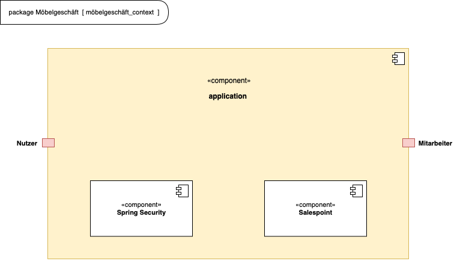
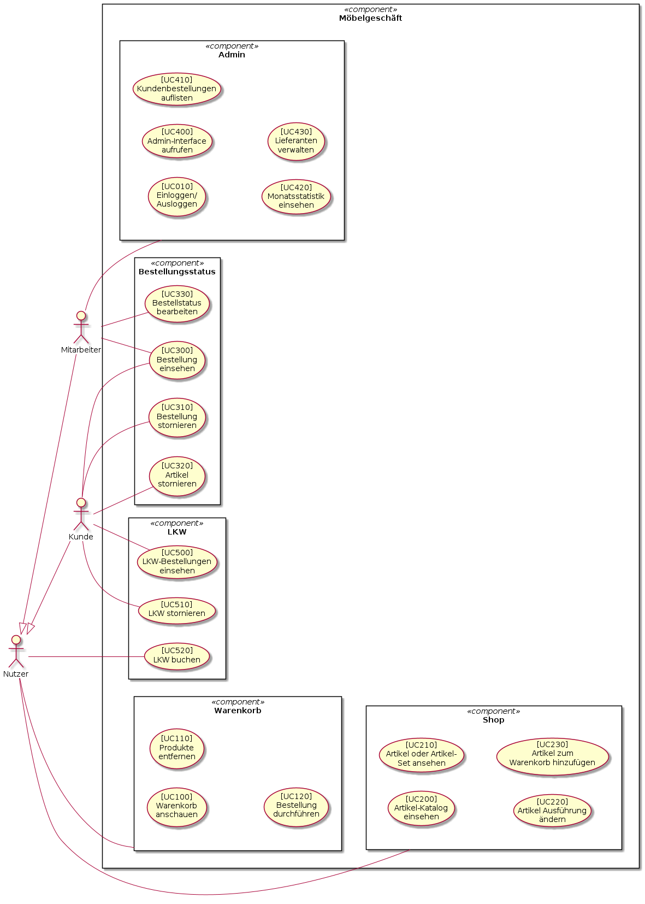
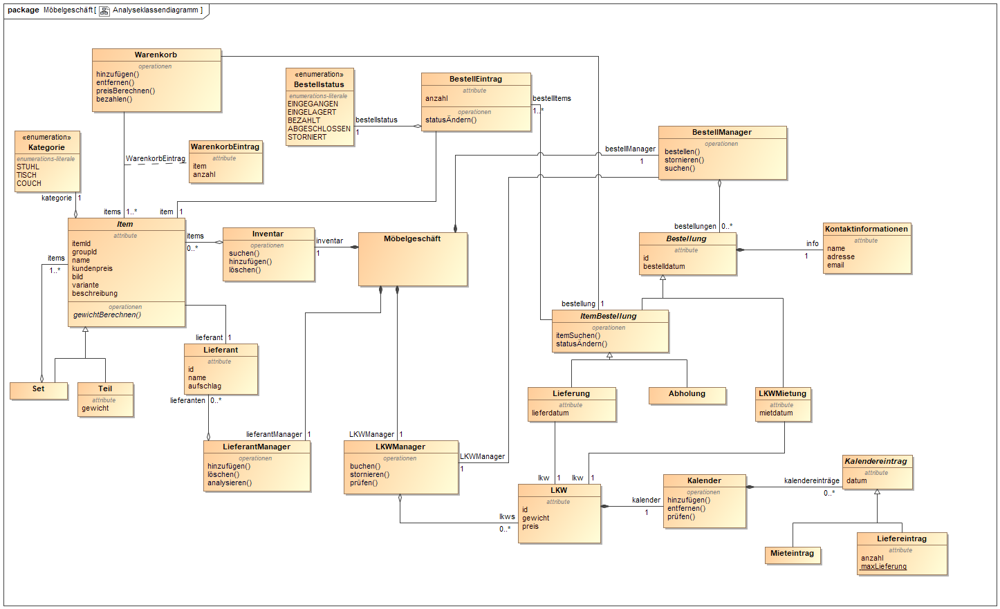

= Pflichtenheft __{project_name}__
:project_name: Möbelgeschäft
:numbered:
:toc:
:toc-title: Inhaltsverzeichnis

[options="header", cols="1a, 1a, 6a, 7a", width="100%"]
|===
|Version | Bearbeitungsdatum | Autoren(en) | Vermerk
|0.1     | 10.11.2020        | David Schroth, Marc Albrecht, Sebastian Jaster, Edgar Wolfert, Johannes Kaufmann, Shintaro Onogi | Kontextdiagramm, Anwendungsfälle, Funktionale Anforderungen, GUI Prototyp, Klassendiagramm, Akzeptanztestfälle
|1.0     | 17.11.2020        | David Schroth, Marc Albrecht, Sebastian Jaster, Edgar Wolfert, Johannes Kaufmann, Shintaro Onogi | Zusammenfassung, Aufgabenstellung, Produktnutzung, Interessensgruppen, Top-Level-Architektur, Nicht-Funktionale Anforderungen, Glossar, Ergänzungen zu 0.1
|===

== Zusammenfassung

Dieses Dokument beschreibt das Pflichtenheft für das Möbelgeschäft-Projekt im Zusammenhang mit dem Softwaretechnologie-Projekt 2020/21. Dabei soll eine Kundensoftware für ein Möbelgeschäft entwickelt werden, welche für die Bestellverwaltung, das Warenlager und den Auslieferungsservice verantwortlich ist.

Im Pflichtenheft sind Informationen bezüglich des Aufbaus des Softwareproduktes zu finden, welche in verschiedene Teilbereiche untergliedert sind.
Das Dokument beinhaltet die Projektanforderungen mit den entsprechenden Zielen für eine gute und einfache Kommunikation zwischen dem Auftraggeber und den Entwicklern.
Die Anforderungen, Funktionalitäten sowie die grundlegende Implementierung der Software wird im Pflichtenheft dargestellt. Es beschreibt zudem welche Funktionen bestimmte Akteure von der Software fordern.
Der Grundaufbau der Software wird im Pflichtenheft durch die Top-Level-Architektur, die Anwendungsfälle mit Akzeptanztestfällen und das Datenmodell für unterschiedliche Nutzer der Software beschrieben.
Des Weiteren beinhaltet es eine detaillierte Beschreibung des Prototyps der grafischen Oberfläche und der Ziele der Software und des Projektes.

== Aufgabenstellung und Zielsetzung

Das von der Moebel-Hunger-Kette übernommene Geschäft Möbel-Hier wird von Ihrer Firma mit einer neuen Kundensoftware ausgestattet. Im Leistungsumfang sind die Bestellverwaltung, das Warenlager und der Auslieferungsservice enthalten. Besonderes Augenmerk soll auf die Warenbestellung, -zwischenlagerung und -auslieferung gelegt werden.

Den Kunden liegt ein Sortiment im Internet vor, aus dem sie Möbel bestellen können, dafür ist keine Anmeldung nötig. Die Lieferung erfolgt entweder in das Hauptlager oder direkt an den Kunden.

Weiterhin soll eine Statusabfrage über die bereits gelieferten Möbelteile der Bestellungen möglich sein. Wenn der Kunde unbedingt will, kann er die bereits gelieferte Ware in Teilen abholen, muss dann aber auch diese Teile sofort bezahlen.

Ein Grundsatz des Möbelhauses heißt Modularität. Der Kunde kann sich die meisten Möbelstücke einzeln bestellen, jedoch auch vorgefertigte Sätze, so z.B. eine Couchecke mit Ein-, Zwei- und Dreisitzer. Variabilität ist beispielsweise über die Farbe oder den Bezug möglich. Einige Möbelstücke können allerdings nur in Kombination mit anderen bestellt werden. Ein Couchtisch besteht beispielsweise aus Gestell und Platte, wobei es von beiden Komponenten mehrere Ausfertigungen gibt.

Die Auslieferung erfolgt mit dem firmeneigenen LKW-Park. Alternativ können sich Kunden auch diese LKW's für einen Tag mieten. Je nach Gewicht der Lieferung soll immer der nächstgünstigere LKW von der Firma zum Ausliefern genutzt werden.

Die Software soll auch das Abbestellung der Ware berücksichtigen. Je nach Bearbeitungsstand einer Lieferung errechnet sich eine Rücklieferungsgebühr. Die Stornierung eines LKW ist kostenlos.

Das Angebotsspektrum von Möbel-Hier ergibt sich aus den Katalogen der angegliederten Großlieferanten. Die Geschäftsbeziehungen zu diesen Firmen soll entsprechend verwaltet werden. Die Preiskalkulation für die Waren findet gruppiert nach den Großlieferanten statt, so ergeben bspw. die Kundenpreise der Waren des Lieferanten Großmöbel 205% des Lieferpreises.

Die Mitarbeiter sollten durch eine Anmeldung die Möglichkeit haben, Bestellungen einzusehen oder zu bearbeiten sowie das Möbelgeschäft zu verwalten. Um die Attraktivität des Angebotes steigern zu können, möchte die Geschäftsführung von Möbel-Hier eine monatliche Abrechnung (mit Vergleich zum Vormonat) haben, in der die Möbelverkäufe nach Großlieferanten aufgegliedert aufgeführt sind.

Das Projekt dient dazu Studenten an den Prozess der professionellen Softwareentwicklung heranzubringen und auf das spätere Berufsleben vorzubereiten.
Am Ende des Projektes soll eine Software vorliegen, welche den gegebenen Anforderungen entspricht und eine realitätsgetreue Kundensoftware für ein Möbelgeschäft beschreibt.

== Produktnutzung

Dieser Abschnitt gibt einen kurzen Überblick über die geplante Verwendung des Produkts.

Das System soll als Webshop von Möbel-hier verwendet werden, um Möbel und Möbel-Sets zu verkaufen und auszuliefern. Einige dieser Möbel-Sets können von den Kunden noch vor der Bestellung individuell angepasst werden. Außerdem beinhaltet das System einen LKW-Verleih, über den die Liefer-LKWs direkt an die Kunden vermietet werden können.
Die Kunden sollen mithilfe eines Browsers jederzeit Zugriff auf den Webshop haben.

Das System ist für folgende Browser aufrufbar und optimiert:

- Mozilla Firefox, Version 82.0.1+
- Chromium basierende Browser, Version 86.0.4240.1+

Die Hauptnutzer des Webshops sind Kunden, die bereits mit der üblichen Webseite-Navigation vertraut sind. Mitarbeiter der Moebel-Hunger-Kette haben erweiterten Zugriff auf bestellungsrelevante Informationen, brauchen dafür jedoch kein technisches Sachverständnis. Alle für sie relevanten Daten sind in einer Datenbank abgespeichert und mithilfe einer grafischen Oberfläche direkt auf der Webseite aufrufbar.

== Interessensgruppen (Stakeholders)

Hier ist eine Auflistung aller realen und juristischen Personengruppen, die einen Einfluss auf die Anforderungen des Systems haben. Jeder Personengruppe ist neben ihren Hauptzielen auch eine Priorität von eins bis fünf zugeordnet, welche bei Interessenkonflikten für eine einfachere Entscheidung sorgt.

[options="header", cols="2a, 1a, 4a, 4a", width="100%"]
|===
|Name
|Priorität (1..5)
|Beschreibung
|Ziele

|Vorsitzende der Moebel-Hunger-Kette
|5
|Der Auftraggeber dieses Projekts.
|
- mehr Möbel verkaufen
- mehr LKWs vermieten
- Abläufe automatisieren
- effiziente Organisation von Bestellungen

|Nutzer
|3
|Hauptnutzer des Systems, sollen Gewinn einbringen
|
- gute Nutzererfahrung
- einfaches Durchstöbern des Katalogs
- schnelle Bestellungsverarbeitung

|Mitarbeiter der Moebel-Hunger-Kette
|4
|Nutzer des Systems, die alles Bestellungsrelevante verwalten
|
- Bestellungen verwalten
- Zugriff auf monatliche Statistiken
- Verwaltung der Lieferanten

|Entwickler
|3
|Implementierer und Verwalter des Systems
|
- ein einfach erweiterbares System
- wenig Verwaltungsaufwand
- gute Debug-Möglichkeiten
|===

== Systemgrenze und Top-Level-Architektur

=== Kontextdiagramm

Das Kontextdiagramm zeigt das geplante Software-System in seiner Umgebung.

=== Top-Level-Architektur

== Anwendungsfälle

=== Akteure
[[actors]]
Akteure sind die Benutzer des Software-Systems oder Nachbarsysteme, welche darauf zugreifen.

// See http://asciidoctor.org/docs/user-manual/#tables
[options="header", cols="1a, 4a", width="100%"]
|===
|**Name**      | **Beschreibung**
|_Nutzer_      |Ein Nutzer repräsentiert jede Person die mit der Seite interagiert.
|_Kunde_       |Ein Kunde repräsentiert jede Person, die auf der Seite ihre Bestellnummer angegeben hat um mit ihrer Bestellung zu interagieren.
|_Mitarbeiter_ |Ein Mitarbeiter repräsentiert die Mitarbeiter der Möbel-Hunger Kette, welche im System die Rolle "Mitarbeiter" erhalten, nachdem Sie sich entsprechend eingeloggt haben.
|===

=== Überblick Anwendungsfalldiagramm

Anwendungsfall-Diagramm, das alle Anwendungsfälle und alle Akteure darstellt.

[[usecase_diagram]]

=== Anwendungsfallbeschreibungen

Dieser Unterabschnitt beschreibt die Anwendungsfälle.

[cols="1h, 3a", width="100%"]
[[UC010]]
|===
|ID                         |**<<UC010>>**
|Name                       |Einloggen/Ausloggen.
|Beschreibung               |
_Einloggen:_

Ein Mitarbeiter der Firma kann sich mithilfe von notwendigen Logindaten gegenüber dem System authentifizieren, um die Rolle des Mitarbeiters im System zu erhalten.

_Ausloggen:_

Ein Mitarbeiter kann sich wieder aus dem System ausloggen.

|Akteur                     |Mitarbeiter
|Auslöser                   |
_Einloggen:_

Der Mitarbeiter möchte die Rolle Mitarbeiter im System erhalten, um auf die restlichen Admin-Komponenten zuzugreifen.

_Ausloggen:_

Der Mitarbeiter möchte nicht mehr die Rolle des Mitarbeiters im System haben.

|Bedingungen                |
_Einloggen:_

Der Mitarbeiter besitzt gültige Logindaten für das System.

_Ausloggen:_

Der Mitarbeiter hat sich mithilfe von <<UC010>> gegenüber dem System authentifiziert.
|Notwendige Schritte        |
_Einloggen:_

1. Mitarbeiter klickt auf den Admin Button in der Navigationsleiste.
2. Mitarbeiter gibt seine gültigen Logindaten an.
3. Mitarbeiter bestätigt seine Eingaben mit einem Klick auf den "Login" Button.

_Ausloggen:_

Der Mitarbeiter klickt auf den Logout Button in der Navigationsleiste und wird auf die Startseite zurückgeleitet.
|Erweiterungen              |
|Funktionale Anforderung    |<<F0050>>, <<F0051>>, <<F0052>>
|===

[cols="1h, 3a", width="100%"]
[[UC100]]
|===
|ID                         |**<<UC100>>**
|Name                       |Warenkorb anschauen
|Beschreibung               |Ein Nutzer der Seite ist in der Lage seinen Warenkorb einzusehen.
|Akteur                     |Nutzer
|Auslöser                   |Der Nutzer möchte die Artikel anschauen, die er bisher in den Warenkorb gelegt hat.
|Bedingungen                |-
|Notwendige Schritte        |Nutzer klickt auf den Warenkorb in der Navigationsleiste.
|Erweiterungen              |-
|Funktionale Anforderung    |<<F0010>>, <<F0011>>
|===

[cols="1h, 3a", width="100%"]
[[UC110]]
|===
|ID                         |**<<UC110>>**
|Name                       |Produkte entfernen
|Beschreibung               |Ein Nutzer kann gegeben Falls Artikel aus seinem Warenkorb entfernen, wenn er sie z.B. nicht mehr benötigt oder bestellen möchte.
|Akteur                     |Nutzer
|Auslöser                   |Der Nutzer möchte einen bestimmten Artikel nicht mehr bestellen.
|Bedingungen                |Der Nutzer befindet sich im Warenkorb <<UC100>>.
|Notwendige Schritte        |Nutzer klickt auf das rote Kreuz am jeweiligen Artikel im Warenkorb um den Artikel zu löschen.
|Erweiterungen              |-
|Funktionale Anforderung    |<<F0010>>, <<F0012>>
|===

[cols="1h, 3a", width="100%"]
[[UC120]]
|===
|ID                         |**<<UC120>>**
|Name                       |Bestellung durchführen
|Beschreibung               |Ein Nutzer hat die Möglichkeit seine Artikel im Warenkorb zu bestellen und damit einen Bestellauftrag auszulösen.
|Akteur                     |Nutzer
|Auslöser                   |Der Nutzer ist mit seinem Einkauf fertig und möchte nun seine Bestellung aufgeben.
|Bedingungen                |Der Nutzer hat Artikel im Warenkorb und schaut sich den Warenkorb <<UC100>> an.
|Notwendige Schritte        |
1. Nutzer klickt auf "Bestellen" im Warenkorb.
2. Nutzer gibt persönliche Daten (Name, Adresse und E-Mail) an und wählt die Versandoption aus (Lieferung oder Abholung).
3. Nutzer bestätigt die Eingaben und die Bestellung mithilfe des Buttons "Bestellung abschicken" und wird auf die Katalog-Seite weitergeleitet.
|Erweiterungen              |-
|Funktionale Anforderung    |<<F0020>>, <<F0021>>
|===
[[sequence_uc120]]
image::./images/sequence_usecases/sequence_uc120.png[sequence_uc120,90%,100%,pdfwidth=100%,title= "Sequenzdiagramm für <<UC120>> Bestellung durchführen",align=center]

[cols="1h, 3a", width="100%"]
[[UC200]]
|===
|ID                         |**<<UC200>>**
|Name                       |Artikel-Katalog einsehen
|Beschreibung               |Ein Nutzer hat die Möglichkeit sich den kompletten Artikel-Katalog von Möbel-Hunger anzuschauen.
|Akteur                     |Nutzer
|Auslöser                   |Der Nutzer möchte den Artikel-Katalog anschauen
|Bedingungen                |-
|Notwendige Schritte        |Der Nutzer klickt auf "Katalog" in der Navigationsleiste.
|Erweiterungen              |-
|Funktionale Anforderung    |<<F0002>>
|===

[cols="1h, 3a", width="100%"]
[[UC210]]
|===
|ID                         |**<<UC210>>**
|Name                       |Artikel oder Artikel-Set ansehen
|Beschreibung               |Ein Nutzer hat die Möglichkeit einzelne Artikel auf der Seite anzuschauen oder vollständige Artikel-Sets.
|Akteur                     |Nutzer
|Auslöser                   |Der Nutzer interessiert sich für einen Artikel genauer und möchte auf die zugehörige Artikelseite gelangen.
|Bedingungen                |Der Nutzer schaut sich derzeit den Artikel-Katalog <<UC200>> an.
|Notwendige Schritte        |Der Nutzer klickt auf den Namen oder Bild des gewünschten Artikels.
|Erweiterungen              |-
|Funktionale Anforderung    |<<F0004>>
|===

[cols="1h, 3a", width="100%"]
[[UC220]]
|===
|ID                         |**<<UC220>>**
|Name                       |Artikel Ausführung ändern
|Beschreibung               |Ein Nutzer hat die Möglichkeit die Ausführung (Farbe/Material) eines Artikels oder eines Artikel-Sets zu ändern.
|Akteur                     |Nutzer
|Auslöser                   |Der Nutzer schaut sich einen Artikel bzw ein Artikel-Set an und möchte die unterschiedlichen Ausführungen begutachten.
|Bedingungen                |Der Nutzer schaut sich derzeit den Artikel oder das Artikel-Set <<UC210>> an.
|Notwendige Schritte        |Der Nutzer klickt auf das Dropdown Ausführung auf der Artikel-Seite um die Ausführung zu ändern.
|Erweiterungen              |-
|Funktionale Anforderung    |<<F0004>>
|===
[[sequence_uc220]]
image::./images/sequence_usecases/sequence_uc220.png[sequence_uc220,60%,100%,pdfwidth=50%,title= "Sequenzdiagramm für <<UC220>> Artikel Ausführung ändern.",align=center]

[cols="1h, 3a", width="100%"]
[[UC230]]
|===
|ID                         |**<<UC230>>**
|Name                       |Artikel zum Warenkorb hinzufügen
|Beschreibung               |Ein Nutzer hat die Möglichkeit einzelne Artikel oder Artikel-Sets in seinen Warenkorb hinzuzufügen.
|Akteur                     |Nutzer
|Auslöser                   |Der Nutzer möchte diesen Artikel kaufen und ihn deshalb zu seinem Warenkorb hinzufügen.
|Bedingungen                |Der Nutzer schaut sich derzeit den Artikel oder das Artikel-Set <<UC210>> an.
|Notwendige Schritte        |
    1. Der Nutzer wählt die entsprechende Anzahl des Artikels aus.
    2. Der Nutzer klickt auf den Button "Zum Warenkorb hinzufügen" um den Artikel in der Anzahl hinzuzufügen.
|Erweiterungen              |-
|Funktionale Anforderung    |<<F0010>>, <<F0012>>
|===

[cols="1h, 3a", width="100%"]
[[UC300]]
|===
|ID                         |**<<UC300>>**
|Name                       |Bestellung einsehen
|Beschreibung               |Ein Mitarbeiter ist in der Lage eine beliebige Bestellung einzusehen. Ein Kunde kann mithilfe einer gültigen Bestellnummer seine aufgegebene Bestellung einsehen.
|Akteur                     |Mitarbeiter, Kunde
|Auslöser                   |Ein Mitarbeiter oder ein Kunde möchte sich die Details der Bestellung anschauen.
|Bedingungen                |
_Mitarbeiter:_

Der Mitarbeiter ist gegenüber dem System authentifiziert und hat die Rolle Mitarbeiter erhalten und hat sich zuvor die Kundenbestellungen aufgelistet <<UC410>>.

_Kunde:_

Der Kunde besitzt eine Bestellungsnummer.
|Notwendige Schritte        |
_Mitarbeiter:_

1. Mitarbeiter sucht die gewünschte Bestellung aus der Liste der Bestellungen heraus.
2. Mitarbeiter klickt auf den Button "Bestellung ansehen" beim jeweiligen Besteilleintrag.
3. Mitarbeiter wird auf die Seite der Bestellung weitergeleitet.

_Kunde:_

1. Kunde wählt den Reiter "Bestellungen" in der Navigationsleiste aus.
2. Kunde gibt seine Bestellnummer in das Eingabefeld ein und drückt auf den Button "Bestellung ansehen".
3. Kunde wird auf die Seite der Bestellung weitergeleitet.

|Erweiterungen              |-
|Funktionale Anforderung    |<<F0023>>
|===

[cols="1h, 3a", width="100%"]
[[UC310]]
|===
|ID                         |**<<UC310>>**
|Name                       |Bestellung stornieren
|Beschreibung               |Ein Kunde soll die Möglichkeit haben seine gesamte Bestellung zu stornieren.
|Akteur                     |Kunde
|Auslöser                   |Der Kunde möchte die komplette Bestellung nicht mehr erhalten.
|Bedingungen                |Der Kunde sieht seine Bestellung derzeit ein <<UC300>>.
|Notwendige Schritte        |Der Kunde klickt den Button "Bestellung stornieren".
|Erweiterungen              |-
|Funktionale Anforderung    |<<F0022>>
|===

[cols="1h, 3a", width="100%"]
[[UC320]]
|===
|ID                         |**<<UC320>>**
|Name                       |Artikel stornieren
|Beschreibung               |Ein Kunde soll die Möglichkeit haben einzelne Artikel seiner Bestellung zu stornieren.
|Akteur                     |Kunde
|Auslöser                   |Der Kunde möchte einzelne Artikel seiner Bestellung nicht mehr erhalten.
|Bedingungen                |Der Kunde sieht seine Bestellung derzeit ein <<UC300>>.
|Notwendige Schritte        |
1. Der Kunde sucht den Artikel aus der Artikel-Liste innerhalb der Bestellung.
2. Der Kunde drückt den zum Artikel zugehörigen Knopf "Artikel stornieren".
|Erweiterungen              |-
|Funktionale Anforderung    |<<F0022>>
|===

[cols="1h, 3a", width="100%"]
[[UC330]]
|===
|ID                         |**<<UC330>>**
|Name                       |Bestellstatus bearbeiten
|Beschreibung               |Ein Mitarbeiter soll in der Lage sein den Status (unbezahlt -> bezahlt) einer Bestellung zu ändern.
|Akteur                     |Mitarbeiter
|Auslöser                   |Ein Kunde hat seine Bestellung per Vorkasse bezahlt und der Mitarbeiter möchte den Zahlungseingang im System bestätigen.
|Bedingungen                |Der Mitarbeiter schaut sich derzeit die Liste der Bestellungen an <<UC410>>.
|Notwendige Schritte        |
1. Der Mitarbeiter sucht die entsprechende Bestellung über die Bestellnummer aus der Liste heraus und klickt auf "Bestellung ansehen"-
2. Der Mitarbeiter wählt den neuen Status aus dem Dropdown aus.
|Erweiterungen              |-
|Funktionale Anforderung    |<<F0020>>, <<F0024>>
|===
[[sequence_uc330]]

[cols="1h, 3a", width="100%"]
[[UC400]]
|===
|ID                         |**<<UC400>>**
|Name                       |Admin-Interface aufrufen
|Beschreibung               |Ein Mitarbeiter ist in der Lage auf das Admin-Interface der Seite zuzugreifen.
|Akteur                     |Mitarbeiter
|Auslöser                   |Ein Mitarbeiter möchte firmeninterne Daten abrufen.
|Bedingungen                |Der Mitarbeiter hat sich zuvor mithilfe von <<UC010>> gegenüber dem System authentifiziert.
|Notwendige Schritte        |Der Mitarbeiter drückt auf den Reiter "Admin" in der Navigationsleiste.
|Erweiterungen              |Der Reiter "Admin" erscheint nur wenn der Nutzer im System die Rolle Mitarbeiter erhalten hat.
|Funktionale Anforderung    |<<F0053>>, <<F0054>>
|===

[cols="1h, 3a", width="100%"]
[[UC410]]
|===
|ID                         |**<<UC410>>**
|Name                       |Kundenbestellungen auflisten
|Beschreibung               |Ein Mitarbeiter soll in der Lage sein sich alle Kundenbestellungen mit Bestelldatum und Bestellnummer aufzulisten.
|Akteur                     |Mitarbeiter
|Auslöser                   |Der Mitarbeiter möchte die Bestellungen einsehen und ggf. eine bestimmte Bestellung suchen.
|Bedingungen                |Der Mitarbeiter befindet sich im Admin-Interface <<UC400>>.
|Notwendige Schritte        |Der Mitarbeiter wählt den Punkt "Kundenbestellungen" aus und wird dadurch auf die Seite mit allen Bestellungen weitergeleitet.
|Erweiterungen              |-
|Funktionale Anforderung    |<<F0057>>
|===

[cols="1h, 3a", width="100%"]
[[UC420]]
|===
|ID                         |**<<UC420>>**
|Name                       |Monatsstatistik einsehen
|Beschreibung               |Ein Mitarbeiter soll in der Lage sein die Monatsstatistik der Firma anzuschauen.
|Akteur                     |Mitarbeiter
|Auslöser                   |Der Mitarbeiter möchte die Verkaufszahlen des letzen Monats anschauen.
|Bedingungen                |Der Mitarbeiter befindet sich im Admin-Interface <<UC400>>.
|Notwendige Schritte        |Der Mitarbeiter wählt den Punkt "Monatsstatistik" aus und wird auf die Seite der Statistik weitergeleitet.
|Erweiterungen              |-
|Funktionale Anforderung    |<<F0055>>, <<F0056>>
|===
[[sequence_uc420]]
image::./images/sequence_usecases/sequence_uc420.png[sequence_uc420,90%,100%,pdfwidth=100%,title= "Sequenzdiagramm für <<UC420>> Monatsstatistik einsehen",align=center]

[cols="1h, 3a", width="100%"]
[[UC430]]
|===
|ID                         |**<<UC430>>**
|Name                       |Lieferanten verwalten
|Beschreibung               |Ein Mitarbeiter soll in der Lage sein die Lieferanten der Firma zu verwalten (löschen/hinzufügen).
|Akteur                     |Mitarbeiter
|Auslöser                   |Der Mitarbeiter möchte einen Lieferanten aus dem System entfernen oder einen neuen Lieferanten hinzufügen.
|Bedingungen                |Der Mitarbeiter befindet sich im Admin-Interface <<UC400>>.
|Notwendige Schritte        |
_Löschen:_

1. Der Mitarbeiter wählt den Punkt "Lieferanten" aus und wird auf die Seite mit einer Liste aller Lieferanten weitergeleitet.
2. Der Mitarbeiter wählt den Button "Lieferant entfernen" in der Zeile des gewünschten Lieferanten aus.

_Hinzufügen:_

1. Der Mitarbeiter wählt den Punkt "Lieferanten" aus und wird auf die Seite mit einer Liste aller Lieferanten weitergeleitet.
2. Der Mitarbeiter gibt den Namen des neuen Lieferanten in das Textfeld ein.
3. Der Mitarbeiter bestätigt die Eingaben mithilfe des Buttons "Lieferant hinzufügen".

|Erweiterungen              |-
|Funktionale Anforderung    |<<F0058>>, <<F0059>>
|===

[cols="1h, 3a", width="100%"]
[[UC500]]
|===
|ID                         |**<<UC500>>**
|Name                       |LKW-Bestellungen einsehen
|Beschreibung               |Ein Kunde soll in der Lage sein, seinen gebuchten LKWs einzusehen.
|Akteur                     |Kunde
|Auslöser                   |Der Kunde möchte die Informationen zu seinem gebuchten LKW einsehen.
|Bedingungen                |Der Kunde hat einen LKW gebucht und eine gültige Buchungsnummer.
|Notwendige Schritte        |
1. Der Kunde drückt auf den Reiter "Bestellungen" und gibt die Nummer seiner LKW Buchung ein.
2. Der Kunde drückt auf "Bestellung ansehen" und wird auf die Detailseite der Buchung weitergeleitet.
|Erweiterungen              |-
|Funktionale Anforderung    |<<F0023>>
|===

[cols="1h, 3a", width="100%"]
[[UC510]]
|===
|ID                         |**<<UC510>>**
|Name                       |LKW stornieren
|Beschreibung               |Ein Kunde soll in der Lage sein, seinen gebuchten LKW wieder zu stornieren.
|Akteur                     |Kunde
|Auslöser                   |Der Kunde benötigt seinen gebuchten LKW nicht mehr.
|Bedingungen                |Der Kunde hat einen LKW gebucht und eine gültige Buchungsnummer und befindet sich auf der Detailseite seiner LKW-Bestellung <<UC500>>.
|Notwendige Schritte        |Der Kunde drückt auf den Button "LKW stornieren".
|Erweiterungen              |-
|Funktionale Anforderung    |<<F0043>>
|===

[cols="1h, 3a", width="100%"]
[[UC520]]
|===
|ID                         |**<<UC520>>**
|Name                       |LKW buchen
|Beschreibung               |Ein Nutzer soll in der Lage sein einen LKW für ein bestimmtes Datum unabhängig von einer Bestellung zu buchen.
|Auslöser                   |Der Nutzer benötigt einen LKW.
|Bedingungen                |-
|Notwendige Schritte        |
1. Der Nutzer wählt in der Navigationsleiste den Reiter "LKW mieten" aus.
2. Der Nutzer wählt einen LKW-Typen aus der Liste aus und drückt auf den Button "Mieten".
3. Der Nutzer gibt seine persönlichen Daten (Name und E-Mail) sowie das Datum auf der Bestellseite ein und drückt auf den Button "LKW mieten".
4. Das System weist dem Nutzer automatisch einen LKW zu und teilt dem Kunden die Bestellnummer mit.
|Erweiterungen              |-
|Funktionale Anforderung    |<<F0042>>
|===
[[sequence_uc520]]
image::./images/sequence_usecases/sequence_uc520.png[sequence_uc520,100%,100%,pdfwidth=100%,title= "Sequenzdiagramm für <<UC520>> LKW buchen",align=center]

== Funktionale Anforderungen

=== Muss-Kriterien

[options="header", cols="2h, 1a, 3a, 12a", width="100%"]
|===
|ID
|Version
|Name
|Description

|[[F0001]]<<F0001>>
|v1.0
|Artikel-Katalog
|
Das System muss eine Liste von Artikeln, welche den Artikel-Katalog repräsentiert, dauerhaft in einer Datenbank speichern.

|[[F0002]]<<F0002>>
|v1.0
|Artikel-Katalog anzeigen
|
Das System muss Nutzern die Möglichkeit bieten, alle Artikel des Artikel-Katalogs anzuzeigen.
Dabei wird für jeden Artikel nur der Name, der Preis und ein Bild des Artikels angezeigt.

|[[F0003]]<<F0003>>
|v1.0
|Artikel-Katalog bearbeiten
|
Das System muss Mitarbeitern die Möglichkeit bieten, Artikel dem Artikel-Katalog hinzuzufügen und Artikel aus dem Artikel-Katalog zu entfernen.

|[[F0004]]<<F0004>>
|v1.0
|Artikel anzeigen
|
Das System muss Nutzern die Möglichkeit bieten einen ausgewählten Artikel anzuzeigen.
Dabei wird ein Bild, der Name, der Preis, die Kategorie und die Variante des Artikels angezeigt.
Die Variante kann dabei geändert werden.

|[[F0010]]<<F0010>>
|v1.0
|Warenkorb
|
Das System muss jedem Nutzer einen eigenen Warenkorb zur Verfügung stellen, in dem er mehrere unterschiedliche Artikel vorübergehend speichern kann.

|[[F0011]]<<F0011>>
|v1.0
|Warenkorb anzeigen
|
Das System muss Nutzern die Möglichkeit bieten, ihren Warenkorb anzuschauen.
Dabei werden die einzelnen Artikel des Warenkorbes mit Namen, Preis und Variante aufgelistet.
Außerdem wird der Gesamtpreis des Warenkorbes angezeigt.

|[[F0012]]<<F0012>>
|v1.0
|Warenkorb bearbeiten
|
Das System muss Nutzern die Möglichkeit bieten, ausgewählte Artikel ihrem Warenkorb hinzuzufügen oder zu entfernen.

|[[F0020]]<<F0020>>
|v1.0
|Bestellung speichern
|
Das System muss Bestellungen in einer Datenbank speichern.
Eine Bestellung besteht aus ein oder mehreren Bestelleinträgen, den Kontaktinformationen des Kunden, einer eindeutigen ID und einem Abholdatum oder alternativ einem LKW Lieferdatum.
Ein Bestelleintrag besteht aus einem Item, der Anzahl des ausgewählten Items und dem Bestellstatus.

|[[F0021]]<<F0021>>
|v1.0
|Bestellung erstellen
|
Das System muss fähig sein eine Bestellung zu erstellen, nachdem der Kunde eine Bestellung aufgegeben hat

|[[F0022]]<<F0022>>
|v1.0
|Bestellung stornieren
|
Das System muss einem Kunden die Möglichkeit bieten, seine gesamte Bestellung oder einzelne Artikel der Bestellung zu stornieren.

|[[F0023]]<<F0023>>
|v1.0
|Bestellung anzeigen
|
Das System muss dem Nutzer die Möglichkeit bieten, über die Bestell-ID, seine Bestellung anzuzeigen.
Dazu gehören Möbel- und LKW-Bestellungen.

|[[F0024]]<<F0024>>
|v1.0
|Bestellstatus bearbeiten
|
Das System muss Mitarbeitern die Möglichkeit bieten, den Status einer Bestellung zu ändern.

|[[F0040]]<<F0040>>
|v1.0
|LKW Park speichern
|
Das System muss eine Liste von LKWs dauerhaft in einer Datenbank speichern.

|[[F0041]]<<F0041>>
|v1.0
|LKW bearbeiten
|
Das System muss fähig sein den Kalender eines LKWs zu bearbeiten.
Der Kalender enthält Kalendereinträge, welche ein Datum haben und einen Mieteintrag oder Liefereintrag.

|[[F0042]]<<F0042>>
|v1.0
|LKW buchen
|
Das System muss Nutzern die Möglichkeit bieten, LKWs aus dem LKW-Park zu buchen.
Bei der Buchung wird zunächst die LKW Bestellung validiert nach <<F0021>>.
Wenn die Bestellung valide ist, wird der Kalender des LKWs bearbeitet nach <<F0041>>.

|[[F0043]]<<F0043>>
|v1.0
|LKW stornieren
|
Das System muss einem Kunden mit einer gültigen Bestell-ID, die Möglichkeit bieten, von ihm gebuchte LKWs zu stornieren.
Dabei wird der Kalendereintrag gelöscht.

|[[F0050]]<<F0050>>
|v1.0
|Mitarbeiter speichern
|
Das System muss Mitarbeiter und deren Logindaten dauerhaft in einer Datenbank speichern.

|[[F0051]]<<F0051>>
|v1.0
|Login
|
Das System muss die Möglichkeit bieten sich einzuloggen.
Ein Mitarbeiter ist ein eingeloggter Nutzer.

|[[F0052]]<<F0052>>
|v1.0
|Logout
|
Das System muss die Möglichkeit bieten sich als Mitarbeiter auszuloggen.

|[[F0053]]<<F0053>>
|v1.0
|Admin Interface
|
Das System muss ein Admin Interface besitzen.
Das Admin Interface beinhaltet eine monatliche Statistik und die Möglichkeit Lieferanten und Bestellungen zu verwalten.

|[[F0054]]<<F0054>>
|v1.0
|Admin Interface anzeigen
|
Das System muss Mitarbeitern die Möglichkeit bieten das Admin Interface anzuzeigen.

|[[F0055]]<<F0055>>
|v1.0
|monatliche Statistik
|
Das System muss fähig sein eine monatliche Statistik zu erstellen, welche die Daten über die Verkäufe des Monats, nach Großlieferant sortiert, zusammenfasst.

|[[F0056]]<<F0056>>
|v1.0
|monatliche Statistik anzeigen
|
Das System muss Mitarbeitern, welche sich im Admin Interface befinden, die Möglichkeit bieten, die monatliche Statistik mit Vergleich der vorherigen monatlichen Statistik anzuzeigen.

|[[F0057]]<<F0057>>
|v1.0
|Bestellungen anzeigen
|
Das System muss Mitarbeitern, welche sich im Admin Interface befinden, die Möglichkeit bieten, alle Bestellungen mit Bestelldatum und Bestellnummer aufzulisten.

|[[F0058]]<<F0058>>
|v1.0
|Lieferanten anzeigen
|
Das System muss Mitarbeitern, welche sich im Admin Interface befinden, die Möglichkeit bieten, alle Lieferanten anzuzeigen.

|===

=== Kann-Kriterien

Anforderungen, die das Programm leisten können soll, aber für den korrekten Betrieb entbehrlich sind.

[options="header", cols="2h, 1a, 3a, 12a", width="100%"]
|===
|ID
|Version
|Name
|Description

|[[F0030]]<<F0030>>
|v1.0
|Kunden benachrichtigen
|
Das System sollte fähig sein, Kunden zu benachrichtigen, wenn ihre bestellte Ware im Hauptlager angekommen ist, bzw. wenn das Abholdatum erreicht ist.

|[[F0059]]<<F0059>>
|v1.0
|Lieferanten verwalten
|
Das System sollte Mitarbeitern, welche sich im Admin Interface befinden, die Möglichkeit bieten, Lieferanten zu löschen oder hinzuzufügen.

|===

== Nicht-Funktionale Anforderungen

=== Qualitätsziele

1 = Nicht wichtig | 5 = Sehr wichtig

[options="header", cols="3h, 1, 1, 1, 1, 1"]
|===
|Qualitätsanspruch        | 1 | 2 | 3 | 4 | 5
|Zuverlässigkeit          |   |   |   |   | x
|Sicherheit               |   |   |   | x |
|Benutzerfreundlichkeit   |   |   |   | x |
|Wartbarkeit              |   |   | x |   |

|===

=== Konkrete Nicht-Funktionale Anforderungen

[options="header", cols="2h, 1a, 3a, 12a", width="100%"]
|===
|ID
|Version
|Name
|Description

|[[NF0001]]<<NF0001>>
|v1.0
|Zuverlässigkeit
|
Die Erreichbarkeit des Systems muss größer als 99 % pro Jahr sein.

|[[NF0002]]<<NF0002>>
|v1.0
|Sicherheit
|
Das System muss Kundendaten verschlüsselt speichern.

|[[NF0003]]<<NF0003>>
|v1.0
|Benutzerfreundlichkeit
|
Ein Nutzer, der nach einem bestimmten Artikel aus dem Artikel-Katalog sucht, sollte weniger als 5 Minuten brauchen, um diesen zu finden.

|[[NF0004]]<<NF0004>>
|v1.0
|Wartbarkeit
|
Die Integration von Erweiterungen muss kleiner gleich 7 Tage sein.

|===

== GUI Prototyp

In diesem Kapitel soll ein Entwurf der Navigationsmöglichkeiten und Dialoge des Systems erstellt werden.

image::./images/GUI/catalog.png[catalog,100%,100%,pdfwidth=100%,title= "Katalog auf der Website",align=center]
[options="header", cols="1h, 12a", width="100%"]
|===
|Nr.  |Beschreibung
|1    |Weiterleitung zum Katalog (catalog.html)
|2    |Weiterleitung zum Warenkorb (cart.html)
|3    |Weiterleitung zu den Bestellungen (orders.html)
|4    |Weiterleitung zur LKW-Vermietung (lkw.html)
|5    |Weiterleitung zum Administrator-Bereich (adminLogin.html)
|6    |Name, Preis und Beschreibung eines Möbelstücks und Weiterleitung zur Großansicht (itemView.html)
|===

image::./images/GUI/itemView.png[itemView,100%,100%,pdfwidth=100%,title= "Ansicht eines Möbelstücks auf der Website",align=center]
[options="header", cols="1h, 12a", width="100%"]
|===
|Nr.  |Beschreibung
|1    |Name, Preis und Beschreibung eines Möbelstücks.
|2    |Auswahl einer Variante des Möbelstücks (z.B. Farbe) über ein Dropdown-Menü
|3    |Schaltfläche, über die das Möbelstück dem Warenkorb hinzugefügt wird
|===

image::./images/GUI/cart.png[cart,100%,100%,pdfwidth=100%,title= "Warenkorb auf der Website",align=center]
[options="header", cols="1h, 12a", width="100%"]
|===
|Nr.  |Beschreibung
|1    |Name des Möbelstücks
|2    |Preis des Möbelstücks
|3    |Änderung der Anzahl des Möbelstücks im Warenkorb (min. 1)
|4    |Schaltfläche zur Entfernung des Möbelstücks aus dem Warenkorb
|5    |Schaltfläche zum Bestellen der Artikel
|===

image::./images/GUI/orders.png[orders,100%,100%,pdfwidth=100%,title= "Bestellungssuche auf der Website",align=center]
[options="header", cols="1h, 12a", width="100%"]
|===
|Nr.  |Beschreibung
|1    |Feld zur Eingabe der Bestellnummer
|2    |Weiterleitung zur Ansicht der Bestellung (orderItems.html)
|===

image::./images/GUI/orderItems.png[orderItems,100%,100%,pdfwidth=100%,title= "Bestellungen auf der Website",align=center]
[options="header", cols="1h, 12a", width="100%"]
|===
|Nr.  |Beschreibung
|1    |Name des Möbelstücks
|2    |Preis des Möbelstücks
|3    |Lieferdatum des Möbelstücks
|4    |Schaltfläche zur Stornierung der Bestellung
|===

image::./images/GUI/lkw.png[lkw,100%,100%,pdfwidth=100%,title= "LKW-Vermietung auf der Website",align=center]
[options="header", cols="1h, 12a", width="100%"]
|===
|Nr.  |Beschreibung
|1    |Gewichtsklasse des LKW 
|2    |Mietpreis für einen Tag
|3    |Schaltfläche zum Mieten des LKW
|===

image::./images/GUI/adminLogin.png[adminLogin,100%,100%,pdfwidth=100%,title= "Administrator-Login auf der Website",align=center]
[options="header", cols="1h, 12a", width="100%"]
|===
|Nr.  |Beschreibung
|1    |Feld zur Eingabe des Nutzernamens 
|2    |Feld zur Eingabe des Passworts
|3    |Schaltfläche zum Einloggen
|===

image::./images/GUI/admin.png[cart,100%,100%,pdfwidth=100%,title= "Administrator-Bereich auf der Website",align=center]
[options="header", cols="1h, 12a", width="100%"]
|===
|Nr.  |Beschreibung
|1    |Schaltfläche zur Ansicht der Kundenbestellungen (customerOrders.html)
|2    |Schaltfläche zur Ansicht der Monatsstatistik (monthlyStatistic.html)
|3    |Schaltfläche zur Ansicht der Lieferanten (suppliers.html)
|===

== Datenmodell

=== Überblick: Klassendiagramm

[[analyseclass_diagram]]

=== Klassen und Enumerationen

Dieser Abschnitt beinhaltet die Beschreibung von Klassen/Enumerationen.

// See http://asciidoctor.org/docs/user-manual/#tables
[options="header", cols="2h, 6a", width="100%"]
[[classes_enumerations]]
|===
|Klasse/Enumeration               |Beschreibung
|Möbelgeschäft                    |Repräsentiert das Geschäft selbst
|WarenkorbEintrag                 |Erfasst einen zu kaufenden Artikel im Warenkorb und deren gewünschte Anzahl            
|Warenkorb                        |Beinhaltet alle gewünschten WarenkorbEinträge des Kunden
|Item                             |Modelliert alle Möbelstücke in unserem Inventar
|Set                              |Ein Set stellt eine Sammlung aus verschiedenen Items dar und modelliert vorgefertigte Sätze an Möbelstücken zu einem Angebotspreis 
|Teil                             |Ist die konkrete Implementierung eines Items
|Inventar                         |Erfasst die Sammlung aller Items und modelliert so ein physisches Inventar
|Kategorie                        |Ist eine Enumeration über alle Kategorien die ein Möbelstück haben kann
|Lieferant                        |Stellt alle unsere registrierten Lieferanten dar
|LieferantManager                 |Verwaltet alle Lieferanten und ermöglicht das Hinzufügen und Entfernen von Lieferanten und ermöglicht das Erstellen einer Lieferantenstatistik
|BestellManager                   |Verwaltet alle aktiven und vergangenen Bestellungen und implementiert das Erstellen und Stornieren jener
|Bestellung                       |Ist eine abstrakte Modellierung aller Bestellungen und beinhaltet alle BestellEinträge
|BestellEintrag                   |Erfasst einen bestellten Artikel mit der Anzahl und dem Bestellstatus
|BestellStatus                    |Ist eine Enumeration und modelliert alle verschiedenen Staten in denen sich ein BestellEintrag befinden kann
|Kontaktinformationen             |Beinhaltet alle relevanten Kontaktinformationen eines Kunden
|ItemBestellung                   |Ist die abstrakte Modellierung für alle physischen Verkaufsartikel
|LKWMietung                       |Modelliert alle benötigten Informationen für die LKWMietung
|Abholung                         |Ist die konkrete Implementierung der ItemBestellung für Items, die aus dem Lager abgeholt werden
|Lieferung                        |Ist die konkrete Implementierung der ItemBestellung für Items, die zum Kunden geliefert werden
|LKWManager                       |Verwaltet alle LKWs und regelt deren Buchung und Stornierung
|LKW                              |Modelliert einen physischen LKW, der entweder gemietet werden kann oder zur Lieferung genutzt wird
|Kalender                         |Erfasst alle Buchungen für alle LKWs und deren Zeitfenster
|KalenderEintrag                  |Stellt als abstrakte Klasse einen Eintrag mit einer Buchung für einen bestimmten Tag und einen bestimmten LKW dar
|Mieteintrag                      |Modelliert die Mietung eines LKWs an einem spezifischen Tag
|Liefereintrag                    |Modelliert die Lieferung einer Bestellung mit einem LKW an einem spezifischen Tag
|===

== Akzeptanztestfälle

Mithilfe von Akzeptanztests wird geprüft, ob die Software die funktionalen Erwartungen und Anforderungen im Gebrauch erfüllt.

:Use: Anwendungsfall
:Pre: Vorbedingung(en)
:Event: Auslöser
:Result: Erwartetes Ergebnis

[cols="1h, 4a", width="100%"]
[[AT010]]
|===
|ID        |**<<AT010>>**
|{Use}     |<<UC010>>
|{Pre}     |Das System verfügt über Mitarbeiter-Anmeldungsdaten.
|{Event}   |Ein nicht authentifizierter Nutzer klickt auf "Login" in der Navigationsliste, gibt seine richtigen Mitarbeiter Daten ein (Name und Password) und klickt auf den "Login" Button.
|{Result}  |
- Der Nutzer wird als Mitarbeiter angemeldet.
- Der Nutzer wird auf die Admin Seite weitergeleitet.
- Der Nutzer hat nun die Möglichkeit auf weitere Funktionalitäten von der Rolle "Mitarbeiter" auf der Seite zuzugreifen.
|===

[cols="1h, 4a", width="100%"]
[[AT011]]
|===
|ID        |**<<AT011>>**
|{Use}     |<<UC010>>
|{Pre}     |Der Nutzer ist als Mitarbeiter angemeldet.
|{Event}   |Ein Mitarbeiter klickt auf "Ausloggen" in der Navigationsleiste.
|{Result}  |
- Der Nutzer wird abgemeldet und hat nicht mehr die Rolle "Mitarbeiter".
- Der Nutzer verliert den Zugriff auf Funktionalitäten der Rolle "Mitarbeiter".
|===

[cols="1h, 4a", width="100%"]
[[AT100]]
|===
|ID        |**<<AT100>>**
|{Use}     |<<UC100>>
|{Pre}     |-
|{Event}   |Ein Nutzer klickt auf "Warenkorb" in der Navigationsleiste.
|{Result}  |
- Der Nutzer wird auf die Warenkorb Seite weitergeleitet.
- Im Warenkorb werden alle Artikel angezeigt, die der Nutzer vorher hinzugefügt hat.
|===

[cols="1h, 4a", width="100%"]
[[AT110]]
|===
|ID        |**<<AT110>>**
|{Use}     |<<UC110>>
|{Pre}     |Ein Nutzer hat Artikel im Warenkorb.
|{Event}   |Ein Nutzer klickt auf den "Entfernen" Button neben dem Artikel im Warenkorb.
|{Result}  |
- Der Artikel wird aus dem Warenkorb entfernt.
- Die Warenkorb Seite wird aktualisiert.
|===

[cols="1h, 4a", width="100%"]
[[AT120]]
|===
|ID        |**<<AT120>>**
|{Use}     |<<UC120>>
|{Pre}     |Ein Nutzer hat Artikel im Warenkorb.
|{Event}   |Ein Nutzer klickt auf den "Artikel bestellen" Button im Warenkorb.
|{Result}  |
- Der Nutzer wird auf eine Seite weitergeleitet, wo er seine persönlichen Daten eingeben und die Lieferoption auswählen muss.
|===

[cols="1h, 4a", width="100%"]
[[AT121]]
|===
|ID        |**<<AT121>>**
|{Use}     |<<UC120>>
|{Pre}     |Ein Nutzer hat Artikel im Warenkorb und hat <<AT120>> gemacht.
|{Event}   |Ein Nutzer klickt auf den "Bestellung abschließen" Button, nachdem er seine persönlichen Daten eingetragen hat.
|{Result}  |
- Seine Bestellung wird aufgegeben und dem Nutzer wird seine Bestellnummer angezeigt.
|===

[cols="1h, 4a", width="100%"]
[[AT200]]
|===
|ID        |**<<AT200>>**
|{Use}     |<<UC200>>
|{Pre}     |-
|{Event}   |Ein Nutzer klickt auf "Katalog" in der Navigationsleiste.
|{Result}  |
- Der Nutzer wird auf die Katalog Seite weitergeleitet.
- Dem Nutzer werden alle verfügbaren Artikel angezeigt.
|===

[cols="1h, 4a", width="100%"]
[[AT210]]
|===
|ID        |**<<AT210>>**
|{Use}     |<<UC210>>
|{Pre}     |Ein Nutzer befindet sich auf der Katalog Seite.
|{Event}   |Ein Nutzer klickt auf einen Artikel im Katalog.
|{Result}  |
- Der Nutzer wird auf die Detailseite des Artikels weitergeleitet.
|===

[cols="1h, 4a", width="100%"]
[[AT220]]
|===
|ID        |**<<AT220>>**
|{Use}     |<<UC220>>
|{Pre}     |Ein Nutzer befindet sich auf der Detailseite eines Artikels.
|{Event}   |Ein Nutzer klickt auf eine andere Ausführung des Artikels.
|{Result}  |
- Der Nutzer wird auf die Detailseite des ausgewählten Artikels weitergeleitet.
|===

[cols="1h, 4a", width="100%"]
[[AT230]]
|===
|ID        |**<<AT230>>**
|{Use}     |<<UC230>>
|{Pre}     |Ein Nutzer befindet sich auf der Detailseite eines Artikels.
|{Event}   |Ein Nutzer klickt auf den "Zum Warenkorb hinzufügen" Button.
|{Result}  |
- Der Artikel wird zu dem persönlichen Warenkorb des Nutzers hinzugefügt.
|===

[cols="1h, 4a", width="100%"]
[[AT300]]
|===
|ID        |**<<AT300>>**
|{Use}     |<<UC300>>
|{Pre}     |Ein Kunde besitzt eine Bestellnummer.
|{Event}   |Ein Nutzer klickt auf "Bestellung einsehen" in der Navigationsleiste.
|{Result}  |
- Der Kunde wird auf deine Seite weitergeleitet, wo er seine Bestellnummer eingeben muss.
|===

[cols="1h, 4a", width="100%"]
[[AT301]]
|===
|ID        |**<<AT301>>**
|{Use}     |<<UC300>>
|{Pre}     |Ein Kunde besitzt eine Bestellnummer und hat <<AT300>> ausgeführt.
|{Event}   |Ein Nutzer klickt auf "Bestätigen" nachdem er seine Bestellnummer eingetragen hat.
|{Result}  |
- Der Kunde wird auf deine Seite weitergeleitet, wo seine Bestellung aufgelistet ist.
|===

[cols="1h, 4a", width="100%"]
[[AT302]]
|===
|ID        |**<<AT302>>**
|{Use}     |<<UC300>>
|{Pre}     |Ein Mitarbeiter befindet sich auf der Kundenbestellungsseite.
|{Event}   |Ein Mitarbeiter klickt eine Bestellung in der Liste an.
|{Result}  |
- Der Mitarbeiter wird auf deine Seite weitergeleitet, wo die Bestellung aufgelistet ist.
|===

[cols="1h, 4a", width="100%"]
[[AT310]]
|===
|ID        |**<<AT310>>**
|{Use}     |<<UC310>>
|{Pre}     |Ein Kunde befindet sich auf der Bestellübersicht.
|{Event}   |Der Kunde klickt den "Bestellung stornieren" Button und anschließen auf den "Bestätigen" Button.
|{Result}  |
- Die gesamte Bestellung wird storniert.
|===

[cols="1h, 4a", width="100%"]
[[AT320]]
|===
|ID        |**<<AT320>>**
|{Use}     |<<UC320>>
|{Pre}     |Ein Kunde befindet sich auf der Bestellübersicht.
|{Event}   |Der Kunde klickt den "Artikel stornieren" Button und anschließen auf den "Bestätigen" Button.
|{Result}  |
- Der Artikel wird storniert.
|===

[cols="1h, 4a", width="100%"]
[[AT330]]
|===
|ID        |**<<AT330>>**
|{Use}     |<<UC330>>
|{Pre}     |Ein Mitarbeiter befindet sich auf einer Bestellübersicht.
|{Event}   |Der Mitarbeiter klickt den "Bestellstatus ändern" Button, wählt einen neuen Status aus und klickt anschließen auf den "Bestätigen" Button.
|{Result}  |
- Der Status der gesamten Bestellung ändert sich zum neuen Status.
|===

[cols="1h, 4a", width="100%"]
[[AT400]]
|===
|ID        |**<<AT400>>**
|{Use}     |<<UC400>>
|{Pre}     |Ein Mitarbeiter ist eingeloggt.
|{Event}   |Der Mitarbeiter klickt auf "Admin-Interface" in der Navigationsleiste.
|{Result}  |
- Der Mitarbeiter wird auf die Admin Seite weitergeleitet.
|===

[cols="1h, 4a", width="100%"]
[[AT410]]
|===
|ID        |**<<AT410>>**
|{Use}     |<<UC410>>
|{Pre}     |Ein Mitarbeiter befindet sich auf der Admin Seite.
|{Event}   |Der Mitarbeiter klickt auf den "Kundenbestellung auflisten" Button.
|{Result}  |
- Der Mitarbeiter wird auf die Kundenbestellungen Seite weitergeleitet.
|===

[cols="1h, 4a", width="100%"]
[[AT420]]
|===
|ID        |**<<AT420>>**
|{Use}     |<<UC420>>
|{Pre}     |Ein Mitarbeiter befindet sich auf der Admin Seite.
|{Event}   |Der Mitarbeiter klickt auf den "Monatsstatistik einsehen" Button.
|{Result}  |
- Der Mitarbeiter wird auf die Monatsstatistik Seite weitergeleitet.
|===

[cols="1h, 4a", width="100%"]
[[AT430]]
|===
|ID        |**<<AT430>>**
|{Use}     |<<UC430>>
|{Pre}     |Ein Mitarbeiter befindet sich auf der Admin Seite.
|{Event}   |Der Mitarbeiter klickt auf "Lieferanten verwalten" Button.
|{Result}  |
- Der Mitarbeiter wird auf die Lieferanten Seite weitergeleitet.
|===

[cols="1h, 4a", width="100%"]
[[AT431]]
|===
|ID        |**<<AT431>>**
|{Use}     |<<UC430>>
|{Pre}     |Ein Mitarbeiter befindet sich auf der Lieferanten Seite.
|{Event}   |Der Mitarbeiter klickt auf den "Lieferant löschen" Button und anschließend auf den "Bestätigen" Button.
|{Result}  |
- Der Lieferant mit allen Artikeln und Verkäufen wird aus dem System gelöscht.
|===

[cols="1h, 4a", width="100%"]
[[AT432]]
|===
|ID        |**<<AT432>>**
|{Use}     |<<UC430>>
|{Pre}     |Ein Mitarbeiter befindet sich auf der Lieferanten Seite.
|{Event}   |Der Mitarbeiter klickt auf "Lieferant hinzufügen" Button.
|{Result}  |
- Der Mitarbeiter wird auf eine Seite weitergeleitet, wo er die Daten des neuen Lieferanten eingeben muss.
|===

[cols="1h, 4a", width="100%"]
[[AT433]]
|===
|ID        |**<<AT433>>**
|{Use}     |<<UC430>>
|{Pre}     |Ein Mitarbeiter befindet sich auf der Lieferanten hinzufügen Seite, nach <<AT432>>.
|{Event}   |Der Mitarbeiter klickt auf "Lieferant hinzufügen" Button, nachdem er die neuen Daten eingetragen hat.
|{Result}  |
- Der Mitarbeiter wird auf die Lieferanten Seite weitergeleitet.
|===

[cols="1h, 4a", width="100%"]
[[AT500]]
|===
|ID        |**<<AT500>>**
|{Use}     |<<UC500>>
|{Pre}     |Ein Kunde besitzt eine LKW-Bestellnummer.
|{Event}   |Ein Nutzer klickt auf "Bestellung einsehen" in der Navigationsleiste.
|{Result}  |
- Der Kunde wird auf deine Seite weitergeleitet, wo er seine LKW-Bestellnummer eingeben muss.
|===

[cols="1h, 4a", width="100%"]
[[AT501]]
|===
|ID        |**<<AT501>>**
|{Use}     |<<UC500>>
|{Pre}     |Ein Kunde besitzt eine LKW-Bestellnummer und hat <<AT500>> ausgeführt.
|{Event}   |Ein Nutzer klickt auf den "Bestätigen" Button, nachdem er seine Bestellnummer eingetragen hat.
|{Result}  |
- Der Kunde wird auf deine Seite weitergeleitet, wo seine LKW-Bestellung aufgelistet ist.
|===

[cols="1h, 4a", width="100%"]
[[AT510]]
|===
|ID        |**<<AT510>>**
|{Use}     |<<UC510>>
|{Pre}     |Ein Kunde befindet sich auf seiner Bestellübersicht.
|{Event}   |Der Kunde klickt auf den "LKW stornieren" Button und anschließend auf den "Bestätigen" Button.
|{Result}  |
- Der LKW wird storniert und die Bestellung aus dem System gelöscht.
|===

[cols="1h, 4a", width="100%"]
[[AT520]]
|===
|ID        |**<<AT520>>**
|{Use}     |<<UC520>>
|{Pre}     |-
|{Event}   |Ein Nutzer klickt auf "LKW buchen" in der Navigationsleiste.
|{Result}  |
- Der Nutzer wird auf eine Seite weitergeleitet, wo er einen LKW-Typen auswählen kann
|===

[cols="1h, 4a", width="100%"]
[[AT521]]
|===
|ID        |**<<AT521>>**
|{Use}     |<<UC520>>
|{Pre}     |Der Nutzer hat einen LKW nach <<AT520>> ausgewählt
|{Event}   |Der Nutzer gibt klickt auf den "Bestellen" Button, nachdem er seine persönlichen Daten und das Datum eingegeben hat
|{Result}  |
- Seine Bestellung wird aufgegeben und dem Nutzer wird seine Bestellnummer angezeigt.
|===

== Glossar

Sämtliche Begriffe, die innerhalb des Projektes verwendet werden und deren gemeinsames Verständnis aller beteiligten Stakeholder essentiell ist, sind hier aufgeführt.

:domain_ref: Siehe <<classes_enumerations, Domänenübersicht>>
:actors_ref: Siehe <<actors, Akteure>>

[options="header", cols="1a, 4a", width="100%"]
[[glossar]]
|===
|Begriff                |Beschreibung
|Abholung               | {domain_ref}
|Abrechnung             | Monatliche Verkaufszahlen/Statistik.
|Bestellung             | {domain_ref}
|Bestelleintrag         | {domain_ref}
|Bestellmanager         | {domain_ref}
|Bestellstatus          | {domain_ref}
|Inventar               | {domain_ref}
|Item                   | {domain_ref}
|Itembestellung         | {domain_ref}
|Kategorie              | {domain_ref}
|Kalendar               | {domain_ref}
|Kalendareintrag        | {domain_ref}
|Kontaktinformationen   | {domain_ref}
|Kunde                  | {actors_ref}
|Lieferung              | {domain_ref}
|Lieferant              | {domain_ref}
|Lieferantmanager       | {domain_ref}
|Liefereintrag          | {domain_ref}
|LKW                    | {domain_ref}
|LKWMietung             | {domain_ref}
|LKWManager             | {domain_ref}
|Login                  | Mitarbeiter haben die Möglichkeit sich einzuloggen und Bestellungen bearbeiten, sowie das Möbelgeschäft zu verwalten.
|Mieteintrag            | {domain_ref}
|Mitarbeiter            | {actors_ref}
|Möbelgeschäft          | {domain_ref}
|Nutzer                 | {actors_ref}
|Set                    | {domain_ref}
|System                 | Allgemeiner Begriff für das Softwaresystem, das während dieses Projekts implementiert werden muss.
|Set                    | {domain_ref}   
|Set                    | {domain_ref}      
|Teil                   | {domain_ref}
|Warenkorb              | {domain_ref}
|Warenkorbeintrag       | {domain_ref}
|===
